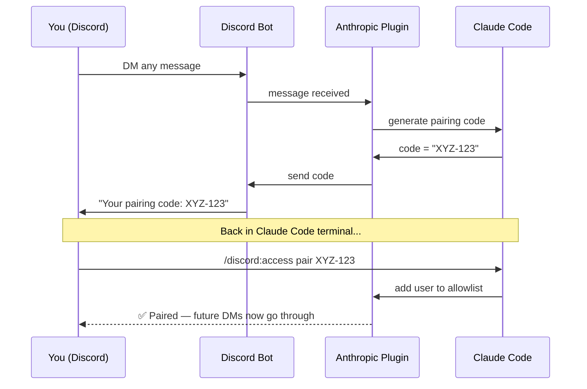

# Discord ↔ Claude Code Channel — Setup Guide

## What This Is

This setup bridges your Discord DMs to a running Claude Code session on your machine. When someone DMs your bot, their message is forwarded to Claude Code, which processes it and sends the reply back through Discord.

This is **not** a standalone bot — it's a live bridge. Claude Code must be running on your machine for it to work.

---

## How It Works


**Key point:** The bot only works while your terminal session is open with `--channels`. Close it → bot goes silent.

---

## Architecture — Who Owns What

```mermaid
flowchart TD
    classDef anthropic fill:#d97706,stroke:none,color:#fff
    classDef discord fill:#5865F2,stroke:none,color:#fff
    classDef local fill:#166534,stroke:none,color:#fff
    classDef user fill:#1e3a5f,stroke:none,color:#fff

    subgraph Discord["Discord (discord.com/developers)"]
        BOT[Bot Application\nhas token + permissions]:::discord
    end

    subgraph Anthropic["Anthropic (claude.ai account)"]
        PLUGIN[discord@claude-plugins-official\ninstalled via /plugin install]:::anthropic
        CC[Claude Code CLI\nclaude --channels ...]:::anthropic
    end

    subgraph Local["Your Machine"]
        BUN[Bun runtime\nrequired by plugin]:::local
        ENV[~/.claude/channels/discord/.env\nstores bot token]:::local
        ACCESS[~/.claude/channels/discord/access.json\nstores allowed Discord user IDs]:::local
    end

    BOT -- "token saved to" --> ENV
    PLUGIN -- "reads token from" --> ENV
    PLUGIN -- "checks allowlist in" --> ACCESS
    CC -- "runs with" --> PLUGIN
    BUN -- "executes" --> PLUGIN
```

---

## Setup Steps

### Prerequisites
- Claude Code v2.1.80+ installed (`brew upgrade claude-code` to update)
- Active claude.ai account (Pro or Max)
- Bun installed

### Step 1 — Create Discord Bot Application

1. Go to [discord.com/developers/applications](https://discord.com/developers/applications)
2. Click **New Application** → name it
3. Go to **Bot** tab → click **Reset Token** → copy the token (only shown once)
4. Scroll down → **Privileged Gateway Intents** → enable **Message Content Intent**

### Step 2 — Invite Bot to a Server

You need a shared server with the bot to be able to DM it.

1. Go to **OAuth2 → URL Generator**
2. Select scope: `bot`
3. Select permissions: View Channels, Send Messages, Read Message History
4. Copy the generated URL → open in browser → select your server → Authorize

### Step 3 — Install Bun

```bash
curl -fsSL https://bun.sh/install | bash
source ~/.bash_profile
```

Verify: `bun --version`

### Step 4 — Install the Discord Plugin

Run these in Claude Code (one at a time):

```
/plugin marketplace add anthropics/claude-plugins-official
/plugin install discord@claude-plugins-official
/reload-plugins
/discord:configure YOUR_BOT_TOKEN_HERE
```

Token is saved to `~/.claude/channels/discord/.env` with `chmod 600`.

### Step 5 — Start the Channel Session

Open a dedicated terminal and run:

```bash
claude --channels plugin:discord@claude-plugins-official
```

You should see:
```
Listening for channel messages from: plugin:discord@claude-plugins-official
```

### Step 6 — Pair Your Discord Account

1. DM your bot on Discord — any message works
2. Bot replies with a pairing code
3. In Claude Code, run: `/discord:access pair YOUR_CODE`
4. Lock down so only you can reach it: `/discord:access policy allowlist`

---

## Pairing Flow Diagram



---

## Daily Use

Every time you want the bot active:

```bash
# In a terminal (keep it open)
claude --channels plugin:discord@claude-plugins-official
```

Then DM your bot on Discord — Claude responds in real time.

Type anything in DMs → Claude Code session on your Mac processes it → reply comes back in Discord.

---

## Limitations

| Works | Doesn't Work |
|---|---|
| Private DMs to the bot | Posting in server channels |
| Full Claude Code capabilities | Reading server messages |
| File access, code execution | Server moderation or management |
| Conversation history in session | Persistent memory after session ends |

Bot is **offline** when the terminal session is closed. This is by design — it only works when you're at your machine.

---

## File Locations

| File | Purpose |
|---|---|
| `~/.claude/channels/discord/.env` | Bot token (credentials, chmod 600) |
| `~/.claude/channels/discord/access.json` | Allowlist of paired Discord user IDs |
| `~/.claude/plugins/` | Installed plugin files |

---

## Related

- [Anthropic Channels Docs](https://code.claude.com/docs/en/channels#discord)
- [Discord Developer Portal](https://discord.com/developers/applications)
- [Claude Plugins Official — GitHub](https://github.com/anthropics/claude-plugins-official/tree/main/external_plugins/discord)
