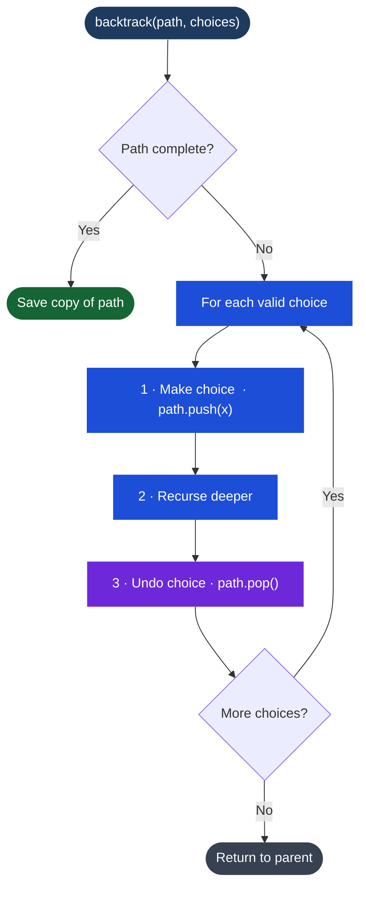

# Backtracking

## What It Is

Backtracking is a systematic way to explore all possible solutions by building a candidate solution incrementally, and abandoning a path ("backtracking") as soon as you determine it cannot lead to a valid solution.

Think of it as DFS on a decision tree: at each node you make a choice, recurse deeper, and then undo that choice when you come back up. The "undo" step is what makes it backtracking rather than plain recursion.

```
Decision tree for subsets of [1,2,3]:
              []
         /    |    \
        [1]  [2]  [3]
       / \    |
    [1,2][1,3][2,3]
      |
   [1,2,3]
```

---

## Process Flow — The Backtracking Loop



*The undo step (pop) is what separates backtracking from plain DFS. Without it, choices from one branch would contaminate the next.*

## The Template

Every backtracking solution follows the same three-step pattern:

```typescript
function backtrack(path: any[], choices: any[]): void {
  // base case: path is complete
  if (isComplete(path)) {
    results.push([...path]); // record a copy, not a reference
    return;
  }

  for (const choice of choices) {
    if (!isValid(choice, path)) continue; // pruning

    // 1. CHOOSE: make the choice
    path.push(choice);

    // 2. EXPLORE: recurse with updated state
    backtrack(path, remainingChoices(choices, choice));

    // 3. UNCHOOSE: undo the choice (backtrack)
    path.pop();
  }
}
```

The critical piece: `path.push(choice)` before recursing, `path.pop()` after. The pop is the backtrack — it restores the state as if the choice was never made.

**Important**: always push a copy (`[...path]`) into `results`, not the path reference itself. Since path is mutated throughout the recursion, pushing a reference will give you stale/empty arrays.

---

## When to Use

- Generate all subsets, permutations, or combinations
- Constraint satisfaction (N-Queens, Sudoku solver)
- Word search on a grid
- Generate all valid parentheses combinations
- Path finding where you need all paths, not just the shortest

**Dead giveaway**: "all possible", "generate all", "find all combinations/permutations/subsets"

---

## TypeScript Examples

### All Subsets of an Array

```typescript
function subsets(nums: number[]): number[][] {
  const results: number[][] = [];

  function backtrack(start: number, path: number[]): void {
    results.push([...path]); // every path is a valid subset (including empty)

    for (let i = start; i < nums.length; i++) {
      path.push(nums[i]);          // choose
      backtrack(i + 1, path);      // explore (start from i+1 to avoid reuse)
      path.pop();                  // unchoose
    }
  }

  backtrack(0, []);
  return results;
}

// subsets([1,2,3]) =>
// [[], [1], [1,2], [1,2,3], [1,3], [2], [2,3], [3]]
```

**Key**: record the path at the start of each call (before the loop), not just at the base case. Every path state is a valid subset.

---

### All Permutations of an Array

```typescript
function permute(nums: number[]): number[][] {
  const results: number[][] = [];

  function backtrack(path: number[], used: boolean[]): void {
    if (path.length === nums.length) {
      results.push([...path]);
      return;
    }

    for (let i = 0; i < nums.length; i++) {
      if (used[i]) continue; // skip already-chosen elements

      used[i] = true;
      path.push(nums[i]);          // choose
      backtrack(path, used);       // explore
      path.pop();                  // unchoose
      used[i] = false;
    }
  }

  backtrack([], new Array(nums.length).fill(false));
  return results;
}

// permute([1,2,3]) =>
// [[1,2,3],[1,3,2],[2,1,3],[2,3,1],[3,1,2],[3,2,1]]
```

**vs subsets**: permutations care about order, so you can pick any unused element at each step (no `start` index). Track `used[]` to avoid picking the same element twice in one path.

---

### Combination Sum (Pick with Repetition)

Find all combinations that sum to `target`. Same element can be reused.

```typescript
function combinationSum(candidates: number[], target: number): number[][] {
  const results: number[][] = [];

  function backtrack(start: number, path: number[], remaining: number): void {
    if (remaining === 0) {
      results.push([...path]);
      return;
    }
    if (remaining < 0) return; // pruning: exceeded target

    for (let i = start; i < candidates.length; i++) {
      path.push(candidates[i]);
      backtrack(i, path, remaining - candidates[i]); // i (not i+1) → allows reuse
      path.pop();
    }
  }

  backtrack(0, [], target);
  return results;
}

// combinationSum([2,3,6,7], 7) => [[2,2,3],[7]]
```

**Subtle difference from subsets**: passing `i` instead of `i + 1` allows the same element to be reused. Passing `i + 1` would prevent reuse.

---

### Word Search on 2D Grid

Find if a word exists in a grid by moving horizontally/vertically.

```typescript
function exist(board: string[][], word: string): boolean {
  const rows = board.length;
  const cols = board[0].length;

  function backtrack(r: number, c: number, index: number): boolean {
    if (index === word.length) return true; // found the full word

    // boundary check and character match
    if (r < 0 || r >= rows || c < 0 || c >= cols) return false;
    if (board[r][c] !== word[index]) return false;

    // choose: mark cell as visited by temporarily modifying it
    const temp = board[r][c];
    board[r][c] = '#'; // mark as visited

    // explore all 4 directions
    const found =
      backtrack(r + 1, c, index + 1) ||
      backtrack(r - 1, c, index + 1) ||
      backtrack(r, c + 1, index + 1) ||
      backtrack(r, c - 1, index + 1);

    // unchoose: restore cell
    board[r][c] = temp;

    return found;
  }

  // try starting from every cell
  for (let r = 0; r < rows; r++) {
    for (let c = 0; c < cols; c++) {
      if (backtrack(r, c, 0)) return true;
    }
  }

  return false;
}

// board = [["A","B","C","E"],["S","F","C","S"],["A","D","E","E"]]
// exist(board, "ABCCED") => true
// exist(board, "SEE") => true
// exist(board, "ABCB") => false (can't reuse B)
```

**Visited trick**: instead of a separate visited set (O(m*n) space), temporarily overwrite the cell with a sentinel `'#'` and restore it on the way back. This keeps space O(1) beyond the call stack.

---

## Pruning — Making Backtracking Efficient

Pruning cuts branches from the decision tree early, before exploring dead ends.

**Common pruning techniques:**
- **Remaining < 0**: if you've exceeded the target in combination sum, return immediately
- **Start index**: always pass a start index to avoid generating duplicates in subset/combination problems
- **Sorting first**: sort the input so you can break early when `candidates[i] > remaining`
- **Deduplication**: when the input has duplicates, skip `candidates[i]` if `i > start && candidates[i] === candidates[i-1]`

```typescript
// Example: combination sum with duplicates (each element used once)
function combinationSum2(candidates: number[], target: number): number[][] {
  candidates.sort((a, b) => a - b); // sort first
  const results: number[][] = [];

  function backtrack(start: number, path: number[], remaining: number): void {
    if (remaining === 0) {
      results.push([...path]);
      return;
    }

    for (let i = start; i < candidates.length; i++) {
      if (candidates[i] > remaining) break; // pruning: sorted, rest will be larger

      // skip duplicates at the same level of the tree
      if (i > start && candidates[i] === candidates[i - 1]) continue;

      path.push(candidates[i]);
      backtrack(i + 1, path, remaining - candidates[i]);
      path.pop();
    }
  }

  backtrack(0, [], target);
  return results;
}
```

---

## Complexity

Backtracking is inherently exponential in the worst case, but pruning makes it practical:

| Problem | Time (worst case) | Notes |
|---|---|---|
| Subsets | O(n · 2ⁿ) | 2ⁿ subsets, O(n) to copy each |
| Permutations | O(n · n!) | n! permutations |
| Combination sum | O(n^(T/min)) | T = target, branching factor × depth |
| Word search | O(4^L · m·n) | L = word length, 4 directions |

---

## Multi-Language Reference — All Subsets

```javascript
// JavaScript
function subsets(nums) {
  const result = [];
  function backtrack(start, current) {
    result.push([...current]);
    for (let i = start; i < nums.length; i++) {
      current.push(nums[i]);
      backtrack(i + 1, current);
      current.pop();
    }
  }
  backtrack(0, []);
  return result;
}
```

```java
// Java
public static List<List<Integer>> subsets(int[] nums) {
    List<List<Integer>> result = new ArrayList<>();
    backtrack(nums, 0, new ArrayList<>(), result);
    return result;
}
private static void backtrack(int[] nums, int start, List<Integer> current, List<List<Integer>> result) {
    result.add(new ArrayList<>(current));
    for (int i = start; i < nums.length; i++) {
        current.add(nums[i]);
        backtrack(nums, i + 1, current, result);
        current.remove(current.size() - 1);
    }
}
```

```python
# Python
def subsets(nums):
    result = []
    def backtrack(start, current):
        result.append(current[:])
        for i in range(start, len(nums)):
            current.append(nums[i])
            backtrack(i + 1, current)
            current.pop()
    backtrack(0, [])
    return result
```

```c
// C (print all subsets — dynamic allocation complex; simplified with fixed size)
void backtrack(int nums[], int n, int start, int current[], int depth) {
    // print current subset
    printf("["); for (int i = 0; i < depth; i++) printf("%d ", current[i]); printf("]\n");
    for (int i = start; i < n; i++) {
        current[depth] = nums[i];
        backtrack(nums, n, i + 1, current, depth + 1);
    }
}
```

```cpp
// C++
void backtrack(vector<int>& nums, int start, vector<int>& current, vector<vector<int>>& result) {
    result.push_back(current);
    for (int i = start; i < nums.size(); i++) {
        current.push_back(nums[i]);
        backtrack(nums, i + 1, current, result);
        current.pop_back();
    }
}
vector<vector<int>> subsets(vector<int>& nums) {
    vector<vector<int>> result; vector<int> current;
    backtrack(nums, 0, current, result); return result;
}
```

## Practice & Resources

**LeetCode — Essential Problems**
- [78 · Subsets](https://leetcode.com/problems/subsets/) — Medium · the simplest backtracking problem
- [46 · Permutations](https://leetcode.com/problems/permutations/) — Medium · track `used[]` array
- [39 · Combination Sum](https://leetcode.com/problems/combination-sum/) — Medium · allow reuse
- [79 · Word Search](https://leetcode.com/problems/word-search/) — Medium · backtracking on grid
- [131 · Palindrome Partitioning](https://leetcode.com/problems/palindrome-partitioning/) — Medium · DFS + check
- [51 · N-Queens](https://leetcode.com/problems/n-queens/) — Hard · canonical hard backtracking

**References**
- [NeetCode · Backtracking playlist](https://neetcode.io/roadmap) — visual decision tree walkthroughs

## Related

- [[DFS (Depth-First Search)]]
- [[Trie]]
