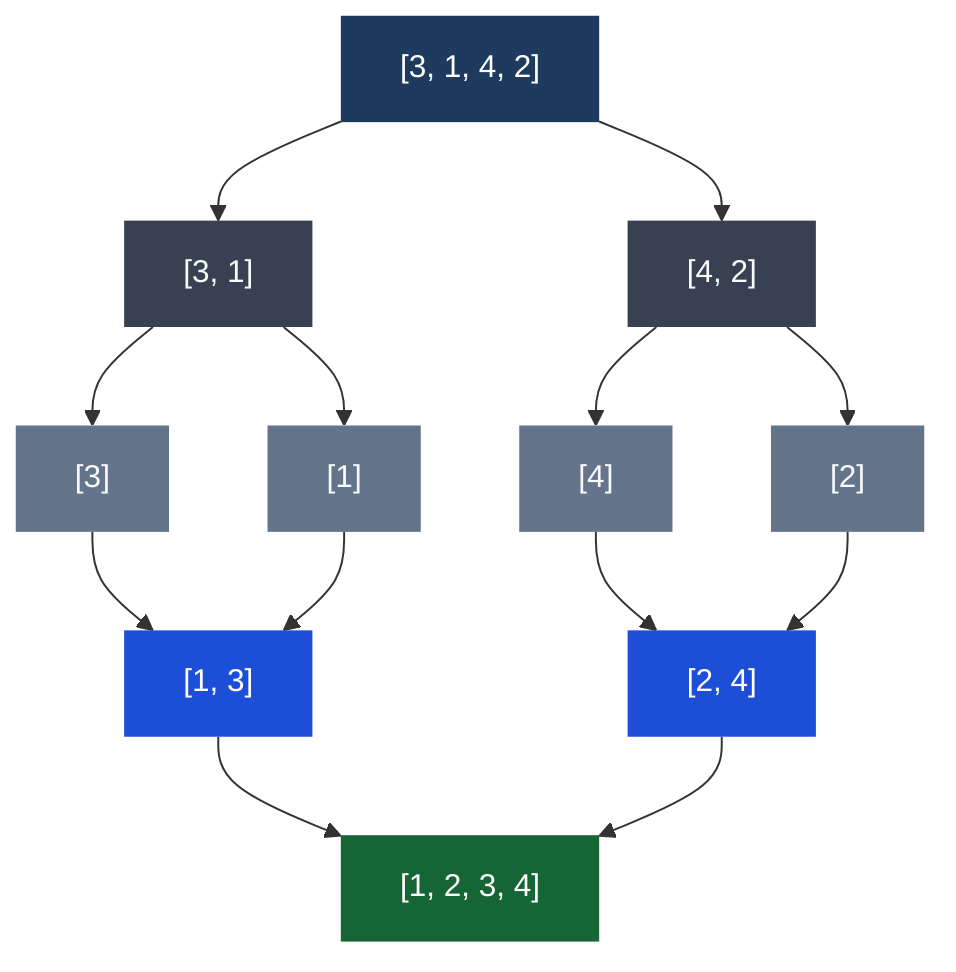

# Sorting Algorithms

## What it is
Algorithms that rearrange elements in a defined order (usually ascending). Knowing which to use depends on data size, whether it's nearly sorted, and memory constraints.

## Diagram — Merge Sort divide & conquer



*Divide until single elements (always sorted), then merge pairs back up.*

## The ones that matter in practice

### Merge Sort — O(n log n) / O(n) space
Divide array in half recursively, sort each half, merge back. Stable sort. Good for large datasets and linked lists.

```typescript
function mergeSort(arr: number[]): number[] {
  if (arr.length <= 1) return arr;
  const mid = Math.floor(arr.length / 2);
  const left = mergeSort(arr.slice(0, mid));
  const right = mergeSort(arr.slice(mid));
  return merge(left, right);
}

function merge(left: number[], right: number[]): number[] {
  const result: number[] = [];
  let i = 0, j = 0;
  while (i < left.length && j < right.length) {
    if (left[i] <= right[j]) result.push(left[i++]);
    else result.push(right[j++]);
  }
  return [...result, ...left.slice(i), ...right.slice(j)];
}
```

### Quick Sort — O(n log n) avg / O(n²) worst / O(log n) space
Pick a pivot, partition around it, recurse. Fast in practice, unstable. Worst case on already-sorted data (bad pivot choice).

### Insertion Sort — O(n²) / O(1) space
Build sorted array one item at a time. Slow on large data, but fast on small or nearly-sorted arrays. Used internally by JS/V8 for small arrays.

### Bubble Sort — O(n²) / O(1) space
Repeatedly swap adjacent elements. Only useful for learning — never in production.

## Quick decision guide

| Situation | Use |
|---|---|
| General purpose, unknown data | Merge sort or built-in `.sort()` |
| Nearly sorted data | Insertion sort |
| Need stable sort + large data | Merge sort |
| Memory constrained, large data | Quick sort |
| Tiny array (< 10 items) | Insertion sort |
| In an interview | Merge sort (easiest to explain correctly) |

## JavaScript's built-in `.sort()`
V8 uses TimSort (hybrid merge + insertion). Always use a comparator for numbers:
```typescript
[3, 1, 10].sort((a, b) => a - b); // [1, 3, 10] ✓
[3, 1, 10].sort(); // [1, 10, 3] ✗ — lexicographic!
```

## Multi-Language Reference — Merge Sort

```javascript
// JavaScript
function mergeSort(arr) {
  if (arr.length <= 1) return arr;
  const mid = Math.floor(arr.length / 2);
  const left = mergeSort(arr.slice(0, mid));
  const right = mergeSort(arr.slice(mid));
  return merge(left, right);
}
function merge(left, right) {
  const result = []; let i = 0, j = 0;
  while (i < left.length && j < right.length)
    result.push(left[i] <= right[j] ? left[i++] : right[j++]);
  return [...result, ...left.slice(i), ...right.slice(j)];
}
// Built-in: arr.sort((a, b) => a - b)  ← always use comparator for numbers!
```

```java
// Java
public static void mergeSort(int[] arr, int left, int right) {
    if (left >= right) return;
    int mid = left + (right - left) / 2;
    mergeSort(arr, left, mid);
    mergeSort(arr, mid + 1, right);
    merge(arr, left, mid, right);
}
private static void merge(int[] arr, int l, int m, int r) {
    int[] tmp = Arrays.copyOfRange(arr, l, r + 1);
    int i = 0, j = m - l + 1, k = l;
    while (i <= m - l && j <= r - l)
        arr[k++] = tmp[i] <= tmp[j] ? tmp[i++] : tmp[j++];
    while (i <= m - l) arr[k++] = tmp[i++];
    while (j <= r - l) arr[k++] = tmp[j++];
}
// Built-in: Arrays.sort(arr)
```

```python
# Python
def merge_sort(arr):
    if len(arr) <= 1: return arr
    mid = len(arr) // 2
    left = merge_sort(arr[:mid])
    right = merge_sort(arr[mid:])
    return merge(left, right)

def merge(left, right):
    result, i, j = [], 0, 0
    while i < len(left) and j < len(right):
        if left[i] <= right[j]: result.append(left[i]); i += 1
        else: result.append(right[j]); j += 1
    return result + left[i:] + right[j:]

# Built-in: arr.sort() or sorted(arr)  — TimSort, O(n log n)
```

```c
// C
void merge(int arr[], int l, int m, int r) {
    int n1 = m-l+1, n2 = r-m;
    int L[n1], R[n2];
    for (int i=0; i<n1; i++) L[i] = arr[l+i];
    for (int j=0; j<n2; j++) R[j] = arr[m+1+j];
    int i=0, j=0, k=l;
    while (i<n1 && j<n2) arr[k++] = L[i]<=R[j] ? L[i++] : R[j++];
    while (i<n1) arr[k++] = L[i++];
    while (j<n2) arr[k++] = R[j++];
}
void mergeSort(int arr[], int l, int r) {
    if (l < r) {
        int m = l + (r-l)/2;
        mergeSort(arr, l, m); mergeSort(arr, m+1, r);
        merge(arr, l, m, r);
    }
}
// Built-in: qsort(arr, n, sizeof(int), compare) from stdlib.h
```

```cpp
// C++
void mergeSort(vector<int>& arr, int l, int r) {
    if (l >= r) return;
    int mid = l + (r - l) / 2;
    mergeSort(arr, l, mid);
    mergeSort(arr, mid + 1, r);
    inplace_merge(arr.begin() + l, arr.begin() + mid + 1, arr.begin() + r + 1);
}
// Built-in: sort(arr.begin(), arr.end())  — introsort, O(n log n)
// Stable:   stable_sort(arr.begin(), arr.end())
```

## Practice & Resources

**LeetCode — Essential Problems**
- [912 · Sort an Array](https://leetcode.com/problems/sort-an-array/) — Medium · implement merge sort or quick sort
- [75 · Sort Colors](https://leetcode.com/problems/sort-colors/) — Medium · Dutch national flag / 3-way partition
- [56 · Merge Intervals](https://leetcode.com/problems/merge-intervals/) — Medium · sort by start, then merge
- [179 · Largest Number](https://leetcode.com/problems/largest-number/) — Medium · custom comparator sort
- [315 · Count of Smaller Numbers After Self](https://leetcode.com/problems/count-of-smaller-numbers-after-self/) — Hard · merge sort with inversion count

**References**
- [VisuAlgo · Sorting](https://visualgo.net/en/sorting) — side-by-side animated comparison of all sorts
- [NeetCode · Arrays & Sorting playlist](https://neetcode.io/roadmap)

## Related
- [[Big O Notation]] — understanding the complexity tradeoffs
- [[Binary Search]] — requires sorted data
