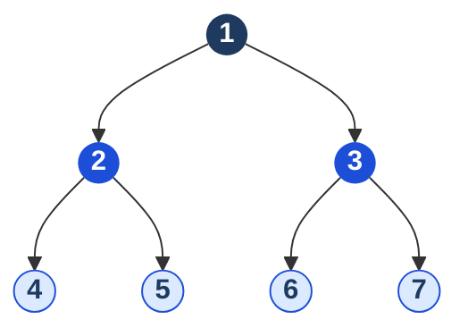
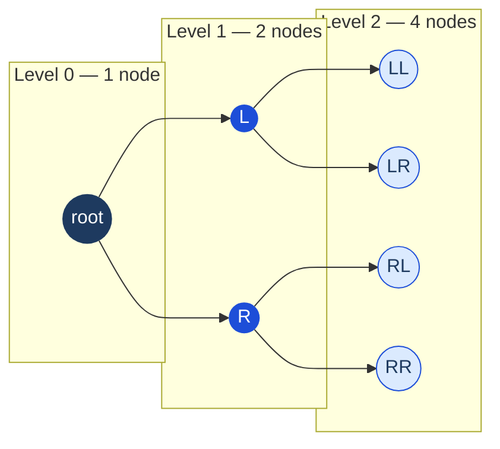
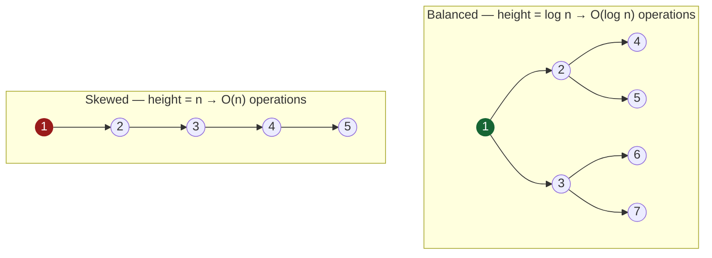
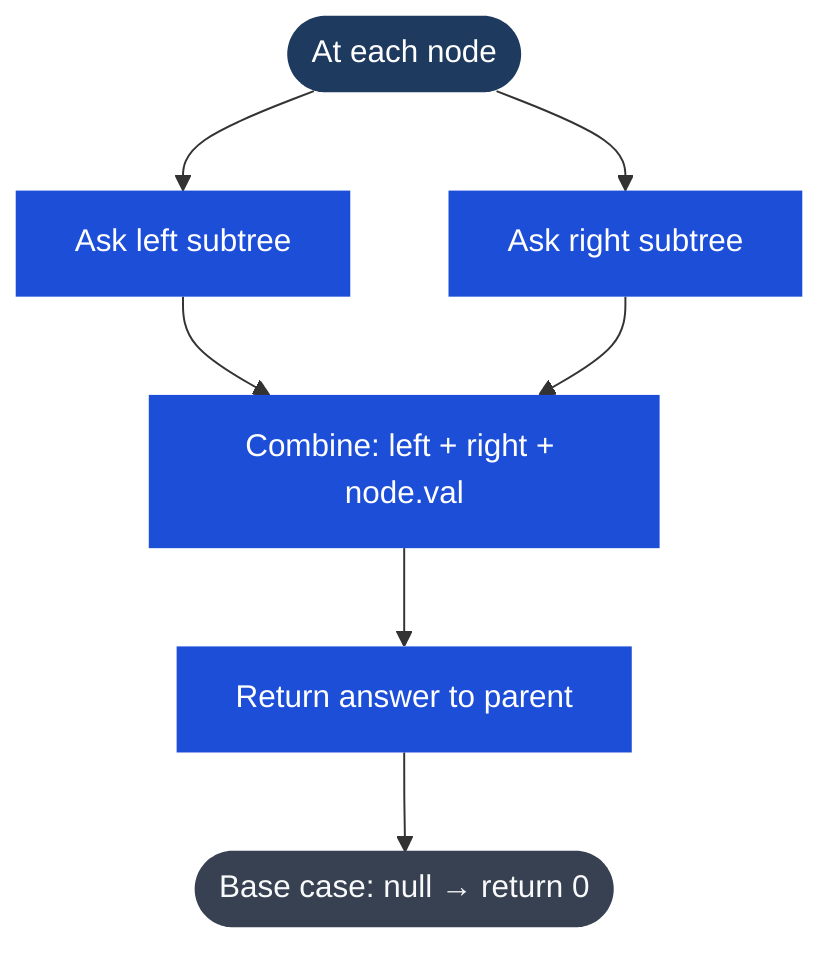

# Binary Tree

## What it is
A tree where each node has **at most two children** (left and right). No ordering requirement — that's a BST.

## Key vocabulary
| Term | Meaning |
|---|---|
| Root | Top node, no parent |
| Leaf | Node with no children |
| Height | Longest path from root to a leaf |
| Depth of node | Distance from root to that node |
| Balanced | Height of left and right subtrees differ by at most 1 at every node |
| Complete | All levels filled except possibly last, which fills left to right |
| Full | Every node has 0 or 2 children (never 1) |
| Perfect | All internal nodes have 2 children, all leaves at same depth |

**Balanced tree height** = O(log n). **Skewed tree** (like a linked list) = O(n).

## Diagram — Tree Structure



*Root (navy) → internal nodes (blue) → leaves (light, no children)*

## How Levels Work — Why It Matters



*Each level doubles. n nodes = log₂(n) levels. 1 million nodes → only ~20 levels deep.*

## Balanced vs Unbalanced — The Critical Difference



*Skewed = effectively a linked list. Self-balancing trees (AVL, Red-Black) prevent this.*

## The Recursive Decision Pattern



**Examples of this pattern:**
- Max depth → `1 + max(leftDepth, rightDepth)`
- Sum of all nodes → `left + right + node.val`
- Is balanced? → `abs(leftHeight - rightHeight) <= 1`

## TypeScript node definition
```typescript
class TreeNode {
  val: number;
  left: TreeNode | null;
  right: TreeNode | null;
  constructor(val = 0, left: TreeNode | null = null, right: TreeNode | null = null) {
    this.val = val;
    this.left = left;
    this.right = right;
  }
}
```

## The 4 traversals (brief)
Full implementations in [[Tree Traversals]].
- **Inorder** (left → root → right): for BST, gives sorted order
- **Preorder** (root → left → right): serialization, copying
- **Postorder** (left → right → root): deletion, subtree calculations
- **Level-order** (BFS): process by depth, shortest path

## Common recursive patterns

### Max depth — O(n)
```typescript
function maxDepth(root: TreeNode | null): number {
  if (!root) return 0;
  return 1 + Math.max(maxDepth(root.left), maxDepth(root.right));
}
```

### Check if balanced — O(n)
```typescript
function isBalanced(root: TreeNode | null): boolean {
  function height(node: TreeNode | null): number {
    if (!node) return 0;
    const left = height(node.left);
    if (left === -1) return -1; // early exit
    const right = height(node.right);
    if (right === -1) return -1;
    if (Math.abs(left - right) > 1) return -1; // unbalanced signal
    return 1 + Math.max(left, right);
  }
  return height(root) !== -1;
}
```

### Lowest Common Ancestor — O(n)
```typescript
function lowestCommonAncestor(root: TreeNode | null, p: TreeNode, q: TreeNode): TreeNode | null {
  if (!root || root === p || root === q) return root;
  const left = lowestCommonAncestor(root.left, p, q);
  const right = lowestCommonAncestor(root.right, p, q);
  // If found in both subtrees, current node is LCA
  if (left && right) return root;
  return left ?? right;
}
```

### Recursion mental model
Most tree problems follow: **"What do I need from my children to answer the question for the current node?"**
- Max depth: max of children + 1
- Sum: sum of children + my value
- Is symmetric: are left and right subtrees mirrors?

## Multi-Language Reference — Max Depth of Binary Tree

```javascript
// JavaScript
function maxDepth(root) {
  if (!root) return 0;
  return 1 + Math.max(maxDepth(root.left), maxDepth(root.right));
}
```

```java
// Java
public int maxDepth(TreeNode root) {
    if (root == null) return 0;
    return 1 + Math.max(maxDepth(root.left), maxDepth(root.right));
}
```

```python
# Python
def max_depth(root):
    if not root:
        return 0
    return 1 + max(max_depth(root.left), max_depth(root.right))
```

```c
// C
int maxDepth(struct TreeNode* root) {
    if (!root) return 0;
    int left = maxDepth(root->left);
    int right = maxDepth(root->right);
    return 1 + (left > right ? left : right);
}
```

```cpp
// C++
int maxDepth(TreeNode* root) {
    if (!root) return 0;
    return 1 + max(maxDepth(root->left), maxDepth(root->right));
}
```

## Practice & Resources

**LeetCode — Essential Problems**
- [104 · Maximum Depth of Binary Tree](https://leetcode.com/problems/maximum-depth-of-binary-tree/) — Easy · simplest recursive pattern
- [226 · Invert Binary Tree](https://leetcode.com/problems/invert-binary-tree/) — Easy · swap children recursively
- [543 · Diameter of Binary Tree](https://leetcode.com/problems/diameter-of-binary-tree/) — Easy · combine left + right height
- [102 · Binary Tree Level Order Traversal](https://leetcode.com/problems/binary-tree-level-order-traversal/) — Medium · BFS on tree
- [105 · Construct Binary Tree from Preorder and Inorder](https://leetcode.com/problems/construct-binary-tree-from-preorder-and-inorder-traversal/) — Medium · rebuild from traversals
- [124 · Binary Tree Maximum Path Sum](https://leetcode.com/problems/binary-tree-maximum-path-sum/) — Hard · gain vs contribution distinction

**References**
- [VisuAlgo · Binary Tree](https://visualgo.net/en/bst) — animated insert/search/delete
- [NeetCode · Trees playlist](https://neetcode.io/roadmap)

## Related
- [[BST]] — binary tree with ordering property
- [[Tree Traversals]] — inorder, preorder, postorder, level-order
- [[DFS (Depth-First Search)]] — all non-level-order traversals are DFS
- [[BFS (Breadth-First Search)]] — level-order traversal
