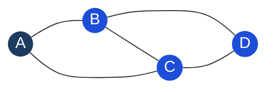

# Graph

## What it is
A collection of **nodes (vertices)** connected by **edges**. The most general data structure — trees and linked lists are special cases of graphs.

## Key properties
| Property | Variants |
|---|---|
| Direction | **Directed** (edges have direction) vs **Undirected** |
| Weight | **Weighted** (edges have cost) vs **Unweighted** |
| Cycles | **Cyclic** vs **Acyclic** (DAG = Directed Acyclic Graph) |
| Connectivity | **Connected** (path between all pairs) vs disconnected |

## Representations

### Adjacency List (use this one — O(V+E) space)
```typescript
// Build from edge list
function buildGraph(n: number, edges: number[][]): Map<number, number[]> {
  const graph = new Map<number, number[]>();
  for (let i = 0; i < n; i++) graph.set(i, []);

  for (const [u, v] of edges) {
    graph.get(u)!.push(v);
    graph.get(v)!.push(u); // remove for directed graph
  }
  return graph;
}
```

### Adjacency Matrix (O(V²) space — use when dense or need O(1) edge lookup)
```typescript
const matrix = Array.from({ length: n }, () => new Array(n).fill(0));
matrix[u][v] = 1;
matrix[v][u] = 1; // for undirected
```

## Diagram — Undirected Graph



*Adjacency list for A: `[B, C]` — each edge stored twice (once per endpoint) in undirected graphs.*

## Key vocabulary
- **Path**: sequence of vertices connected by edges
- **Cycle**: path that starts and ends at same vertex
- **Connected component**: maximal set of vertices reachable from each other
- **DAG**: directed acyclic graph — used for dependency ordering (topological sort)
- **Degree**: number of edges at a vertex

## The main algorithms
| Problem | Algorithm |
|---|---|
| Shortest path (unweighted) | [[BFS (Breadth-First Search)]] |
| Cycle detection, connected components | [[DFS (Depth-First Search)]] |
| Shortest path (weighted, non-negative) | Dijkstra (min-heap + BFS) |
| Topological sort | DFS with finish-time ordering, or Kahn's (BFS-based) |
| Dynamic connectivity | [[Union-Find (Disjoint Set)]] |
| Minimum spanning tree | Prim's or Kruskal's |

## Grid as graph
Many problems use a 2D grid — treat each cell as a node, edges to 4 (or 8) neighbors:
```typescript
const directions = [[0,1],[0,-1],[1,0],[-1,0]]; // 4-directional

function isValid(r: number, c: number, rows: number, cols: number): boolean {
  return r >= 0 && r < rows && c >= 0 && c < cols;
}
```

## Common interview patterns
| Problem | Approach |
|---|---|
| Number of islands | DFS/BFS flood fill on grid |
| Clone graph | DFS + hash map (old node → new node) |
| Course schedule (can you complete all?) | Detect cycle in directed graph |
| Word ladder | BFS (unweighted shortest path) |
| Accounts merge | Union-Find or DFS |

## Multi-Language Reference — Build Adjacency List

```javascript
// JavaScript
function buildGraph(n, edges) {
  const graph = Array.from({ length: n }, () => []);
  for (const [u, v] of edges) { graph[u].push(v); graph[v].push(u); }
  return graph;
}
```

```java
// Java
public static List<List<Integer>> buildGraph(int n, int[][] edges) {
    List<List<Integer>> graph = new ArrayList<>();
    for (int i = 0; i < n; i++) graph.add(new ArrayList<>());
    for (int[] e : edges) { graph.get(e[0]).add(e[1]); graph.get(e[1]).add(e[0]); }
    return graph;
}
```

```python
# Python
from collections import defaultdict
def build_graph(n, edges):
    graph = defaultdict(list)
    for u, v in edges:
        graph[u].append(v)
        graph[v].append(u)
    return graph
```

```c
// C — adjacency list using arrays
#define MAXN 1000
int adj[MAXN][MAXN], deg[MAXN];
void addEdge(int u, int v) { adj[u][deg[u]++] = v; adj[v][deg[v]++] = u; }
```

```cpp
// C++
#include <vector>
vector<vector<int>> buildGraph(int n, vector<vector<int>>& edges) {
    vector<vector<int>> graph(n);
    for (auto& e : edges) { graph[e[0]].push_back(e[1]); graph[e[1]].push_back(e[0]); }
    return graph;
}
```

## Practice & Resources

**LeetCode — Essential Problems**
- [200 · Number of Islands](https://leetcode.com/problems/number-of-islands/) — Medium · DFS/BFS on grid graph
- [133 · Clone Graph](https://leetcode.com/problems/clone-graph/) — Medium · BFS with visited map
- [207 · Course Schedule](https://leetcode.com/problems/course-schedule/) — Medium · cycle detection with DFS
- [994 · Rotting Oranges](https://leetcode.com/problems/rotting-oranges/) — Medium · multi-source BFS
- [417 · Pacific Atlantic Water Flow](https://leetcode.com/problems/pacific-atlantic-water-flow/) — Medium · reverse BFS from borders
- [269 · Alien Dictionary](https://leetcode.com/problems/alien-dictionary/) — Hard · topological sort

**References**
- [NeetCode · Graphs playlist](https://neetcode.io/roadmap)
- [VisuAlgo · Graph traversal](https://visualgo.net/en/graphds) — BFS and DFS animated

## Related
- [[BFS (Breadth-First Search)]] — level-by-level exploration, shortest path
- [[DFS (Depth-First Search)]] — deep exploration, cycle detection
- [[Union-Find (Disjoint Set)]] — dynamic connectivity
