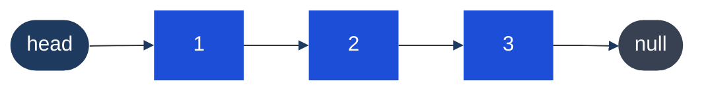

# Linked List

## What it is
A sequence of nodes where each node holds a value and a pointer to the next node. Unlike arrays, nodes are **not contiguous in memory** — you navigate by following pointers.

## Singly vs Doubly

| | Singly | Doubly |
|---|---|---|
| Pointers per node | `next` only | `next` + `prev` |
| Space | O(n) | O(n) — more per node |
| Traverse backwards | No | Yes |
| Delete at current node | Need previous node | O(1) |
| Use case | Most interview problems | LRU cache, browser history |

## Diagram — Singly Linked List



*Navigate only left → right. To delete node 2 you must reach it from node 1.*

## Complexity

| Operation | Complexity | Notes |
|---|---|---|
| Access by index | O(n) | Must walk from head |
| Search | O(n) | Linear scan |
| Insert at head | O(1) | Just update head pointer |
| Insert at tail | O(n) or O(1) | O(1) if tail pointer maintained |
| Delete at head | O(1) | |
| Delete arbitrary node | O(n) | Must find previous node |

## TypeScript node definition (LeetCode style)
```typescript
class ListNode {
  val: number;
  next: ListNode | null;
  constructor(val = 0, next: ListNode | null = null) {
    this.val = val;
    this.next = next;
  }
}
```

## Key operations

### Reverse a linked list (iterative) — O(n) time, O(1) space
```typescript
function reverseList(head: ListNode | null): ListNode | null {
  let prev: ListNode | null = null;
  let curr = head;
  while (curr) {
    const next = curr.next;
    curr.next = prev;
    prev = curr;
    curr = next;
  }
  return prev; // new head
}
```

### Find middle node — O(n)
```typescript
function findMiddle(head: ListNode): ListNode {
  let slow = head, fast = head;
  while (fast.next && fast.next.next) {
    slow = slow.next!;
    fast = fast.next.next;
  }
  return slow; // middle (or first middle for even length)
}
```

### Merge two sorted lists — O(n+m)
```typescript
function mergeTwoLists(l1: ListNode | null, l2: ListNode | null): ListNode | null {
  const dummy = new ListNode(0);
  let curr = dummy;
  while (l1 && l2) {
    if (l1.val <= l2.val) { curr.next = l1; l1 = l1.next; }
    else { curr.next = l2; l2 = l2.next; }
    curr = curr.next;
  }
  curr.next = l1 ?? l2;
  return dummy.next;
}
```

### The dummy node trick
When building a new list or the head might change, use a dummy/sentinel node:
```typescript
const dummy = new ListNode(0);
let curr = dummy;
// ... build list by setting curr.next and advancing curr
return dummy.next; // real head
```

## Detect cycle
Uses Fast & Slow pointers — see [[Fast & Slow Pointers]] for full explanation.

## When to prefer linked list over array
- Frequent insert/delete at the front (O(1) vs O(n) for arrays)
- Size is unknown and constantly changing
- Implementing stacks/queues (though arrays work too)

## Multi-Language Reference — Reverse a Linked List

```javascript
// JavaScript
function reverseList(head) {
  let prev = null, curr = head;
  while (curr) {
    const next = curr.next;
    curr.next = prev;
    prev = curr;
    curr = next;
  }
  return prev;
}
```

```java
// Java
public static ListNode reverseList(ListNode head) {
    ListNode prev = null, curr = head;
    while (curr != null) {
        ListNode next = curr.next;
        curr.next = prev;
        prev = curr;
        curr = next;
    }
    return prev;
}
```

```python
# Python
def reverse_list(head):
    prev, curr = None, head
    while curr:
        curr.next, prev, curr = prev, curr, curr.next
    return prev
```

```c
// C
struct ListNode* reverseList(struct ListNode* head) {
    struct ListNode *prev = NULL, *curr = head;
    while (curr) {
        struct ListNode* next = curr->next;
        curr->next = prev;
        prev = curr;
        curr = next;
    }
    return prev;
}
```

```cpp
// C++
ListNode* reverseList(ListNode* head) {
    ListNode *prev = nullptr, *curr = head;
    while (curr) {
        ListNode* next = curr->next;
        curr->next = prev;
        prev = curr;
        curr = next;
    }
    return prev;
}
```

## Practice & Resources

**LeetCode — Essential Problems**
- [206 · Reverse Linked List](https://leetcode.com/problems/reverse-linked-list/) — Easy · must-know
- [21 · Merge Two Sorted Lists](https://leetcode.com/problems/merge-two-sorted-lists/) — Easy · dummy node pattern
- [141 · Linked List Cycle](https://leetcode.com/problems/linked-list-cycle/) — Easy · fast & slow pointers
- [19 · Remove Nth Node From End](https://leetcode.com/problems/remove-nth-node-from-end-of-list/) — Medium · two-pass or two-pointer
- [143 · Reorder List](https://leetcode.com/problems/reorder-list/) — Medium · combines find-middle + reverse + merge
- [23 · Merge K Sorted Lists](https://leetcode.com/problems/merge-k-sorted-lists/) — Hard · min-heap

**References**
- [VisuAlgo · Linked List](https://visualgo.net/en/list) — animated pointer operations
- [NeetCode · Linked List playlist](https://neetcode.io/roadmap)

## Related
- [[Stack]] — can be implemented with linked list
- [[Queue & Deque]] — can be implemented with linked list
- [[Fast & Slow Pointers]] — cycle detection, middle finding
