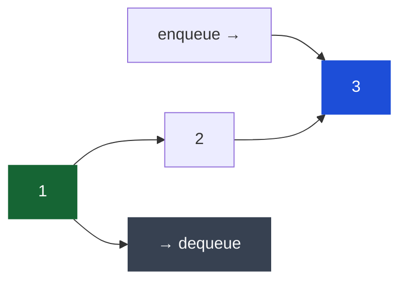

# Queue & Deque

## What it is
**Queue**: FIFO (First In, First Out) — first item enqueued is first dequeued. Think of a line at a register.

**Deque** (Double-Ended Queue): can add/remove from **both** ends. More flexible.

## The JS `shift()` problem
Using a JS array as a queue with `push()` + `shift()` is O(n) because `shift()` reindexes every element. For large queues this kills performance.

**Fix: use a pointer instead of shifting**
```typescript
class Queue<T> {
  private data: T[] = [];
  private head = 0;

  enqueue(val: T): void { this.data.push(val); }

  dequeue(): T | undefined {
    if (this.isEmpty()) return undefined;
    const val = this.data[this.head];
    this.head++;
    // Optional: trim when head has moved far enough
    if (this.head > this.data.length / 2) {
      this.data = this.data.slice(this.head);
      this.head = 0;
    }
    return val;
  }

  peek(): T | undefined { return this.data[this.head]; }
  isEmpty(): boolean { return this.head >= this.data.length; }
  size(): number { return this.data.length - this.head; }
}
```

For interviews: using `shift()` is acceptable — just mention the O(n) tradeoff if asked.

## Complexity (proper implementation)
| Operation | Queue | Deque |
|---|---|---|
| Enqueue (back) | O(1) | O(1) |
| Dequeue (front) | O(1) | O(1) |
| Add/remove front | — | O(1) |
| Peek | O(1) | O(1) |

## Diagram — FIFO (First In, First Out)



*Enqueue joins the back (blue); dequeue removes from the front (orange) — first in, first out.*

## When to use
- **Queue**: BFS, level-order traversal, task scheduling, any "process in order" scenario
- **Deque**: sliding window maximum, palindrome check, implement both stack and queue

## Sliding window maximum — monotonic deque
Classic hard problem: find max in every window of size k in O(n) using a deque.
```typescript
function maxSlidingWindow(nums: number[], k: number): number[] {
  const deque: number[] = []; // stores indices, front = current max
  const result: number[] = [];

  for (let i = 0; i < nums.length; i++) {
    // Remove indices outside window
    while (deque.length && deque[0] < i - k + 1) deque.shift();

    // Remove smaller elements from back (they'll never be the max)
    while (deque.length && nums[deque[deque.length - 1]] < nums[i]) deque.pop();

    deque.push(i);

    if (i >= k - 1) result.push(nums[deque[0]]);
  }
  return result;
}
// [1,3,-1,-3,5,3,6,7], k=3 → [3,3,5,5,6,7]
```

## BFS template
Queue is the backbone of BFS — see [[BFS (Breadth-First Search)]] for full implementation.

```typescript
// Core pattern
const queue: TreeNode[] = [root];
while (queue.length) {
  const node = queue.shift()!; // use pointer-based queue for performance
  // process node
  if (node.left) queue.push(node.left);
  if (node.right) queue.push(node.right);
}
```

## Multi-Language Reference — Queue Operations

```javascript
// JavaScript (array as queue — use pointer trick for O(1) dequeue)
class Queue {
  #data = []; #head = 0;
  enqueue(val) { this.#data.push(val); }
  dequeue() { return this.#data[this.#head++]; }
  peek() { return this.#data[this.#head]; }
  get size() { return this.#data.length - this.#head; }
}
```

```java
// Java — use LinkedList or ArrayDeque (never Queue + LinkedList for performance)
Queue<Integer> queue = new LinkedList<>();  // or new ArrayDeque<>()
queue.offer(1);          // enqueue
int front = queue.poll();  // dequeue
int peek = queue.peek();   // peek without removing
```

```python
# Python — use deque from collections (O(1) both ends)
from collections import deque
queue = deque()
queue.append(1)       # enqueue
front = queue.popleft()  # dequeue O(1)
# list.pop(0) is O(n) — never use for queues
```

```c
// C — implement with circular array or linked list
typedef struct { int data[1000]; int front, rear; } Queue;
void enqueue(Queue* q, int val) { q->data[q->rear++] = val; }
int dequeue(Queue* q) { return q->data[q->front++]; }
int isEmpty(Queue* q) { return q->front == q->rear; }
```

```cpp
// C++
#include <queue>
queue<int> q;
q.push(1);          // enqueue
int front = q.front(); q.pop();  // dequeue
// For deque (both ends):
#include <deque>
deque<int> dq;
dq.push_back(1); dq.push_front(2);
dq.pop_back(); dq.pop_front();
```

## Practice & Resources

**LeetCode — Essential Problems**
- [933 · Number of Recent Calls](https://leetcode.com/problems/number-of-recent-calls/) — Easy · queue sliding window
- [622 · Design Circular Queue](https://leetcode.com/problems/design-circular-queue/) — Medium · implement from scratch
- [239 · Sliding Window Maximum](https://leetcode.com/problems/sliding-window-maximum/) — Hard · monotonic deque

**References**
- [NeetCode · Stack & Queue playlist](https://neetcode.io/roadmap)
- [VisuAlgo · Queue](https://visualgo.net/en/list) — animated enqueue/dequeue

## Related
- [[Stack]] — LIFO counterpart
- [[BFS (Breadth-First Search)]] — always uses a queue
- [[Linked List]] — doubly linked list is the ideal deque implementation
