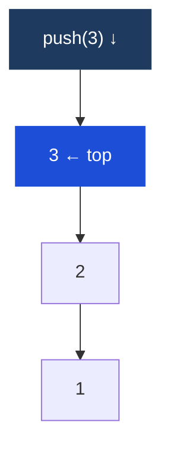

# Stack

## What it is
A **LIFO** (Last In, First Out) data structure. The last item pushed is the first item popped. Think of a stack of plates.

In JavaScript, just use an array — `push()` and `pop()` are both O(1).

## Complexity
| Operation | Complexity |
|---|---|
| Push | O(1) |
| Pop | O(1) |
| Peek (top element) | O(1) |
| Search | O(n) |

## Diagram — LIFO (Last In, First Out)



*push adds to top; pop removes from top — the bottom element is never touched until everything above it is gone.*

## When to reach for a stack
- **Balanced parentheses** / bracket matching
- **Undo/redo** — push actions, pop to undo
- **DFS iteratively** — explicit stack replaces call stack
- **Monotonic stack** — next greater/smaller element problems
- **Function call tracing** — how the JS call stack itself works
- **Expression evaluation** — postfix notation

## TypeScript — array as stack
```typescript
const stack: number[] = [];
stack.push(1);          // [1]
stack.push(2);          // [1, 2]
stack.push(3);          // [1, 2, 3]
const top = stack[stack.length - 1]; // peek = 3
stack.pop();            // returns 3, stack = [1, 2]
```

## Key problems

### Valid parentheses
```typescript
function isValid(s: string): boolean {
  const stack: string[] = [];
  const map: Record<string, string> = { ')': '(', '}': '{', ']': '[' };

  for (const char of s) {
    if ('({['.includes(char)) {
      stack.push(char);
    } else {
      if (stack.pop() !== map[char]) return false;
    }
  }
  return stack.length === 0;
}
```

### Monotonic stack — next greater element
Keep a stack of elements waiting for their "next greater". Pop when you find it.
```typescript
function nextGreaterElement(nums: number[]): number[] {
  const result = new Array(nums.length).fill(-1);
  const stack: number[] = []; // stores indices

  for (let i = 0; i < nums.length; i++) {
    while (stack.length && nums[i] > nums[stack[stack.length - 1]]) {
      const idx = stack.pop()!;
      result[idx] = nums[i];
    }
    stack.push(i);
  }
  return result;
}
// [2, 1, 2, 4, 3] → [4, 2, 4, -1, -1]
```

### Min stack — O(1) getMin
Track the current minimum alongside each value:
```typescript
class MinStack {
  private stack: [number, number][] = []; // [value, currentMin]

  push(val: number): void {
    const min = this.stack.length ? Math.min(val, this.stack[this.stack.length - 1][1]) : val;
    this.stack.push([val, min]);
  }
  pop(): void { this.stack.pop(); }
  top(): number { return this.stack[this.stack.length - 1][0]; }
  getMin(): number { return this.stack[this.stack.length - 1][1]; }
}
```

## Multi-Language Reference — Valid Parentheses

```javascript
// JavaScript
function isValid(s) {
  const stack = [], map = { ')': '(', '}': '{', ']': '[' };
  for (const c of s) {
    if ('({['.includes(c)) stack.push(c);
    else if (stack.pop() !== map[c]) return false;
  }
  return stack.length === 0;
}
```

```java
// Java
public static boolean isValid(String s) {
    Deque<Character> stack = new ArrayDeque<>();
    for (char c : s.toCharArray()) {
        if (c == '(' || c == '{' || c == '[') stack.push(c);
        else {
            if (stack.isEmpty()) return false;
            char top = stack.pop();
            if ((c == ')' && top != '(') || (c == '}' && top != '{') || (c == ']' && top != '['))
                return false;
        }
    }
    return stack.isEmpty();
}
```

```python
# Python
def is_valid(s):
    stack, mapping = [], {')': '(', '}': '{', ']': '['}
    for c in s:
        if c in '({[': stack.append(c)
        elif not stack or stack.pop() != mapping[c]: return False
    return not stack
```

```c
// C
int isValid(char* s) {
    char stack[10001]; int top = -1;
    for (int i = 0; s[i]; i++) {
        char c = s[i];
        if (c == '(' || c == '{' || c == '[') stack[++top] = c;
        else {
            if (top < 0) return 0;
            char t = stack[top--];
            if ((c == ')' && t != '(') || (c == '}' && t != '{') || (c == ']' && t != '[')) return 0;
        }
    }
    return top == -1;
}
```

```cpp
// C++
bool isValid(string s) {
    stack<char> st;
    for (char c : s) {
        if (c == '(' || c == '{' || c == '[') st.push(c);
        else {
            if (st.empty()) return false;
            char t = st.top(); st.pop();
            if ((c == ')' && t != '(') || (c == '}' && t != '{') || (c == ']' && t != '[')) return false;
        }
    }
    return st.empty();
}
```

## Practice & Resources

**LeetCode — Essential Problems**
- [20 · Valid Parentheses](https://leetcode.com/problems/valid-parentheses/) — Easy · bracket matching
- [155 · Min Stack](https://leetcode.com/problems/min-stack/) — Medium · track running min
- [739 · Daily Temperatures](https://leetcode.com/problems/daily-temperatures/) — Medium · monotonic stack
- [150 · Evaluate Reverse Polish Notation](https://leetcode.com/problems/evaluate-reverse-polish-notation/) — Medium · expression evaluation
- [84 · Largest Rectangle in Histogram](https://leetcode.com/problems/largest-rectangle-in-histogram/) — Hard · monotonic stack

**References**
- [VisuAlgo · Stack](https://visualgo.net/en/list) — animated push/pop
- [NeetCode · Stack playlist](https://neetcode.io/roadmap)

## Related
- [[Queue & Deque]] — FIFO counterpart
- [[DFS (Depth-First Search)]] — iterative DFS uses an explicit stack
- [[Linked List]] — alternative implementation
