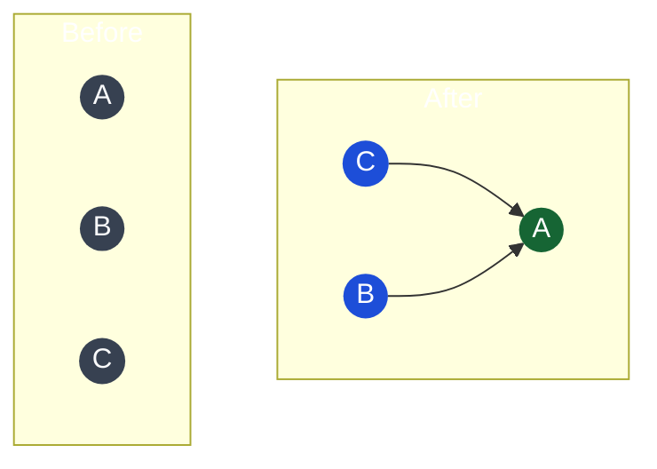

# Union-Find (Disjoint Set)

## What it is
A data structure that efficiently answers: **"Are these two elements in the same group?"** and **"Merge these two groups."**

It tracks a collection of disjoint (non-overlapping) sets and supports two operations:
- **find(x)** — which set does x belong to? (returns representative/root)
- **union(x, y)** — merge the sets containing x and y

## Why it beats BFS/DFS for connectivity
- BFS/DFS: O(V+E) per query — must re-traverse the graph
- Union-Find: nearly O(1) per operation with optimizations — ideal when you're **repeatedly checking and updating connectivity**

## Optimizations
Without optimizations: O(n) per operation.
- **Path compression**: when finding root, flatten the tree so all nodes point directly to root
- **Union by rank**: always attach smaller tree under larger — keeps tree flat

With both: O(α(n)) amortized — effectively O(1) for all practical inputs (α is inverse Ackermann function, ≤ 4 for any realistic n).

## Diagram — Before and after union(A,B), union(B,C)



*After both unions: A is root (representative) of the set {A, B, C}. `find(C)` → A, `find(B)` → A.*

## TypeScript implementation
```typescript
class UnionFind {
  private parent: number[];
  private rank: number[];
  private components: number;

  constructor(n: number) {
    this.parent = Array.from({ length: n }, (_, i) => i);
    this.rank = new Array(n).fill(0);
    this.components = n;
  }

  find(x: number): number {
    if (this.parent[x] !== x) {
      this.parent[x] = this.find(this.parent[x]); // path compression
    }
    return this.parent[x];
  }

  union(x: number, y: number): boolean {
    const rootX = this.find(x);
    const rootY = this.find(y);
    if (rootX === rootY) return false; // already connected

    // Union by rank
    if (this.rank[rootX] < this.rank[rootY]) {
      this.parent[rootX] = rootY;
    } else if (this.rank[rootX] > this.rank[rootY]) {
      this.parent[rootY] = rootX;
    } else {
      this.parent[rootY] = rootX;
      this.rank[rootX]++;
    }
    this.components--;
    return true;
  }

  connected(x: number, y: number): boolean {
    return this.find(x) === this.find(y);
  }

  count(): number { return this.components; }
}
```

## Classic problems
```typescript
// Number of connected components
function countComponents(n: number, edges: number[][]): number {
  const uf = new UnionFind(n);
  for (const [u, v] of edges) uf.union(u, v);
  return uf.count();
}

// Detect redundant connection (cycle in undirected graph)
function findRedundantConnection(edges: number[][]): number[] {
  const n = edges.length;
  const uf = new UnionFind(n + 1);
  for (const [u, v] of edges) {
    if (!uf.union(u, v)) return [u, v]; // already connected = cycle
  }
  return [];
}
```

## Union-Find vs BFS/DFS decision guide
| Scenario | Use |
|---|---|
| Static graph, single connectivity check | BFS or DFS |
| **Dynamic**: edges added over time, repeated connectivity queries | Union-Find |
| Need actual path between nodes | BFS/DFS |
| Just need "same group?" answer | Union-Find |
| Minimum spanning tree (Kruskal's) | Union-Find |

## Multi-Language Reference — Union-Find (Path Compression + Union by Rank)

```javascript
// JavaScript
class UnionFind {
  constructor(n) { this.parent = Array.from({length: n}, (_, i) => i); this.rank = new Array(n).fill(0); }
  find(x) { if (this.parent[x] !== x) this.parent[x] = this.find(this.parent[x]); return this.parent[x]; }
  union(x, y) {
    const [rx, ry] = [this.find(x), this.find(y)];
    if (rx === ry) return false;
    if (this.rank[rx] < this.rank[ry]) this.parent[rx] = ry;
    else if (this.rank[rx] > this.rank[ry]) this.parent[ry] = rx;
    else { this.parent[ry] = rx; this.rank[rx]++; }
    return true;
  }
  connected(x, y) { return this.find(x) === this.find(y); }
}
```

```java
// Java
class UnionFind {
    int[] parent, rank;
    UnionFind(int n) { parent = new int[n]; rank = new int[n]; for (int i = 0; i < n; i++) parent[i] = i; }
    int find(int x) { if (parent[x] != x) parent[x] = find(parent[x]); return parent[x]; }
    boolean union(int x, int y) {
        int rx = find(x), ry = find(y);
        if (rx == ry) return false;
        if (rank[rx] < rank[ry]) parent[rx] = ry;
        else if (rank[rx] > rank[ry]) parent[ry] = rx;
        else { parent[ry] = rx; rank[rx]++; }
        return true;
    }
}
```

```python
# Python
class UnionFind:
    def __init__(self, n):
        self.parent = list(range(n))
        self.rank = [0] * n
    def find(self, x):
        if self.parent[x] != x:
            self.parent[x] = self.find(self.parent[x])
        return self.parent[x]
    def union(self, x, y):
        rx, ry = self.find(x), self.find(y)
        if rx == ry: return False
        if self.rank[rx] < self.rank[ry]: self.parent[rx] = ry
        elif self.rank[rx] > self.rank[ry]: self.parent[ry] = rx
        else: self.parent[ry] = rx; self.rank[rx] += 1
        return True
```

```c
// C
int parent[1001], rnk[1001];
int find(int x) { return parent[x] == x ? x : (parent[x] = find(parent[x])); }
int unionFind(int x, int y) {
    int rx = find(x), ry = find(y);
    if (rx == ry) return 0;
    if (rnk[rx] < rnk[ry]) parent[rx] = ry;
    else if (rnk[rx] > rnk[ry]) parent[ry] = rx;
    else { parent[ry] = rx; rnk[rx]++; }
    return 1;
}
void init(int n) { for (int i = 0; i <= n; i++) { parent[i] = i; rnk[i] = 0; } }
```

```cpp
// C++
struct UnionFind {
    vector<int> parent, rank;
    UnionFind(int n) : parent(n), rank(n, 0) { iota(parent.begin(), parent.end(), 0); }
    int find(int x) { return parent[x] == x ? x : parent[x] = find(parent[x]); }
    bool unite(int x, int y) {
        int rx = find(x), ry = find(y);
        if (rx == ry) return false;
        if (rank[rx] < rank[ry]) swap(rx, ry);
        parent[ry] = rx;
        if (rank[rx] == rank[ry]) rank[rx]++;
        return true;
    }
};
```

## Practice & Resources

**LeetCode — Essential Problems**
- [684 · Redundant Connection](https://leetcode.com/problems/redundant-connection/) — Medium · detect cycle edge with Union-Find
- [547 · Number of Provinces](https://leetcode.com/problems/number-of-provinces/) — Medium · count disjoint components
- [721 · Accounts Merge](https://leetcode.com/problems/accounts-merge/) — Medium · union by shared email
- [1584 · Min Cost to Connect All Points](https://leetcode.com/problems/min-cost-to-connect-all-points/) — Medium · Kruskal's MST with Union-Find
- [128 · Longest Consecutive Sequence](https://leetcode.com/problems/longest-consecutive-sequence/) — Medium · union consecutive numbers

**References**
- [NeetCode · Advanced Graphs playlist](https://neetcode.io/roadmap)
- [CP Algorithms · DSU](https://cp-algorithms.com/data_structures/disjoint_set_union.html) — proof of inverse Ackermann complexity

## Related
- [[Graph]] — Union-Find answers connectivity questions about graphs
- [[BFS (Breadth-First Search)]] — alternative for static connectivity
- [[DFS (Depth-First Search)]] — alternative for static connectivity
