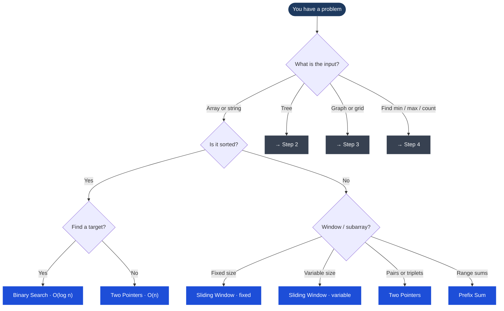
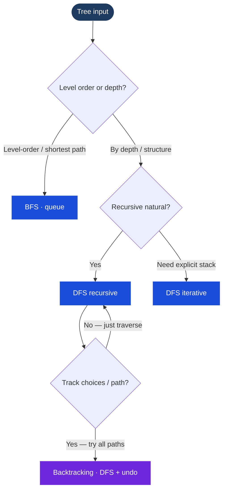
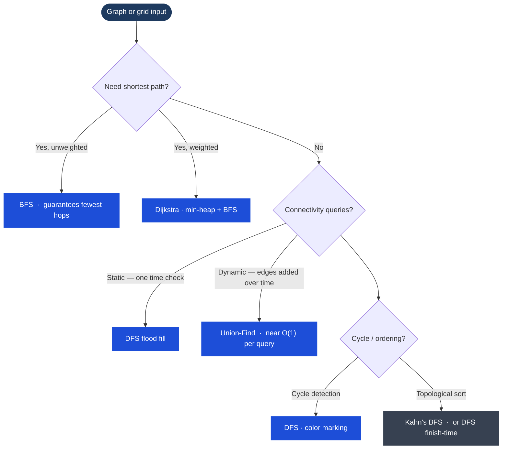

> [!pattern] Meta · Navigation

# Algorithm Decision Tree

Use this when you see a problem and don't know where to start. Follow the questions.

## Step 1 — What kind of data?



## Step 2 — Tree problems



## Step 3 — Graph problems



## Step 4 — Optimization problems

```mermaid
flowchart TD
    classDef start fill:#1e3a5f,stroke:none,color:#fff
    classDef answer fill:#1d4ed8,stroke:none,color:#fff
    classDef key fill:#166534,stroke:none,color:#fff
    classDef alt fill:#374151,stroke:none,color:#f9fafb
    OPT(["Find min / max / count ways"]):::start --> A{Greedy works?}
    A -->|Yes — local best = global best| GR["Greedy  ·  O(n) or O(n log n)"]:::answer
    A -->|No — must consider all options| B{Overlapping subproblems?}
    B -->|Yes — same state recomputed| DP["Dynamic Programming"]:::key
    B -->|No — subproblems independent| DC["Divide & Conquer"]:::alt
    DP --> C{State dimensions?}
    C -->|1D  ·  dp[i]| DP1["Fibonacci · coin change · stairs"]:::answer
    C -->|2D  ·  dp[i][j]| DP2["Grid paths · LCS · knapsack"]:::answer
```

---

## Quick Reference — Pattern Triggers

| You see this in the problem... | Reach for... |
|---|---|
| "sorted array", "find target" | [[Binary Search]] |
| "subarray with sum/length condition" | [[Sliding Window]] |
| "two elements that sum to X" | [[Two Pointers]] |
| "minimum steps / shortest path" | [[BFS (Breadth-First Search)]] |
| "all possible combinations / paths" | [[Backtracking]] |
| "max/min of overlapping subproblems" | [[Dynamic Programming]] |
| "can always take the locally best" | [[Greedy]] |
| "connected components / same group" | [[Union-Find (Disjoint Set)]] |
| "detect cycle in graph" | [[DFS (Depth-First Search)]] |
| "prefix matching / autocomplete" | [[Trie]] |
| "kth largest / top k elements" | [[Heap (Priority Queue)]] |

---

## Related
- [[BFS (Breadth-First Search)]]
- [[DFS (Depth-First Search)]]
- [[Dynamic Programming]]
- [[Two Pointers]]
- [[Sliding Window]]
- [[Binary Search]]
- [[Backtracking]]
- [[Greedy]]
- [[Union-Find (Disjoint Set)]]
