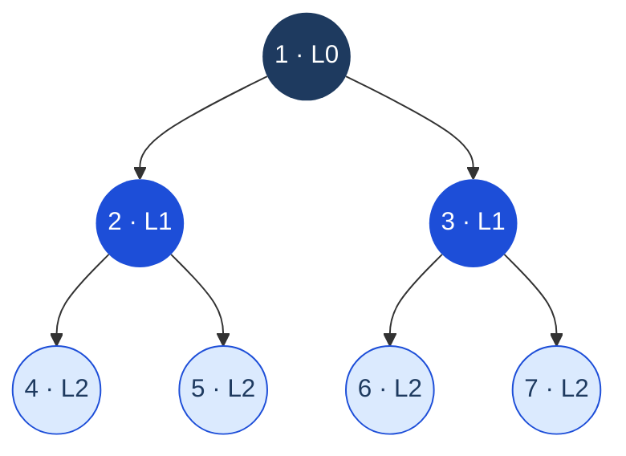
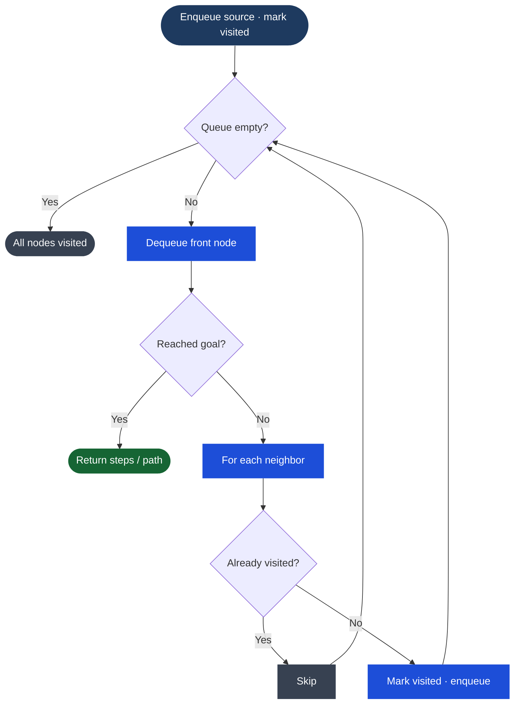

> [!pattern] Graph Traversal · Level-Order

# BFS (Breadth-First Search)

## What it is
Explore a graph or tree **level by level** — visit all neighbors of a node before going deeper. Uses a **queue** (FIFO).

> [!complexity] Complexity
> - Time: O(V + E) for graphs, O(n) for trees
> - Space: O(V) — queue can hold up to a full level

## Diagram — Level-by-Level Traversal



*Visit order: 1 → 2, 3 → 4, 5, 6, 7. All of level N visited before level N+1.*

## Process Flow — The BFS Loop



*Mark visited on enqueue, not dequeue — prevents duplicates in the queue.*

## The critical insight
**BFS guarantees shortest path in unweighted graphs.** DFS does not. If a problem asks for minimum steps/hops, reach for BFS immediately.

## Template — BFS on graph
```typescript
function bfs(graph: Map<number, number[]>, start: number): void {
  const visited = new Set<number>([start]);
  const queue: number[] = [start];

  while (queue.length) {
    const node = queue.shift()!;
    // Process node here

    for (const neighbor of graph.get(node) ?? []) {
      if (!visited.has(neighbor)) {
        visited.add(neighbor);
        queue.push(neighbor);
      }
    }
  }
}
```

## Template — BFS level-order on binary tree
```typescript
function levelOrder(root: TreeNode | null): number[][] {
  if (!root) return [];
  const result: number[][] = [];
  const queue: TreeNode[] = [root];

  while (queue.length) {
    const levelSize = queue.length; // snapshot — process exactly this level
    const level: number[] = [];

    for (let i = 0; i < levelSize; i++) {
      const node = queue.shift()!;
      level.push(node.val);
      if (node.left) queue.push(node.left);
      if (node.right) queue.push(node.right);
    }
    result.push(level);
  }
  return result;
}
```

## Shortest path with BFS — track distance
```typescript
function shortestPath(graph: Map<number, number[]>, start: number, end: number): number {
  const visited = new Set<number>([start]);
  const queue: [number, number][] = [[start, 0]]; // [node, distance]

  while (queue.length) {
    const [node, dist] = queue.shift()!;
    if (node === end) return dist;

    for (const neighbor of graph.get(node) ?? []) {
      if (!visited.has(neighbor)) {
        visited.add(neighbor);
        queue.push([neighbor, dist + 1]);
      }
    }
  }
  return -1; // unreachable
}
```

## BFS on a grid (flood fill pattern)
```typescript
function bfsGrid(grid: number[][], startR: number, startC: number): number {
  const rows = grid.length, cols = grid[0].length;
  const dirs = [[0,1],[0,-1],[1,0],[-1,0]];
  const queue: [number, number][] = [[startR, startC]];
  grid[startR][startC] = -1; // mark visited by mutating (or use a Set)
  let steps = 0;

  while (queue.length) {
    const size = queue.length;
    for (let i = 0; i < size; i++) {
      const [r, c] = queue.shift()!;
      for (const [dr, dc] of dirs) {
        const nr = r + dr, nc = c + dc;
        if (nr >= 0 && nr < rows && nc >= 0 && nc < cols && grid[nr][nc] === 1) {
          grid[nr][nc] = -1;
          queue.push([nr, nc]);
        }
      }
    }
    steps++;
  }
  return steps;
}
```

## BFS vs DFS — when to pick
| Problem type | Use |
|---|---|
| Shortest path (unweighted) | **BFS** |
| Level-order / by depth | **BFS** |
| Detect cycle | DFS |
| All possible paths | DFS |
| Connected components | Either |
| Topological sort | DFS (or Kahn's BFS) |

## Classic problems
- Word Ladder (min transformations = BFS)
- Rotting Oranges (multi-source BFS)
- Shortest Path in Binary Matrix
- Minimum Depth of Binary Tree

## Multi-Language Reference — BFS on Graph

> [!example]- JavaScript
> ```javascript
> // JavaScript
> function bfs(graph, start) {
>   const visited = new Set([start]);
>   const queue = [start];
>   while (queue.length) {
>     const node = queue.shift();
>     for (const neighbor of graph.get(node) ?? []) {
>       if (!visited.has(neighbor)) { visited.add(neighbor); queue.push(neighbor); }
>     }
>   }
> }
> ```

> [!example]- Java
> ```java
> // Java
> public static void bfs(Map<Integer, List<Integer>> graph, int start) {
>     Set<Integer> visited = new HashSet<>();
>     Queue<Integer> queue = new LinkedList<>();
>     visited.add(start); queue.add(start);
>     while (!queue.isEmpty()) {
>         int node = queue.poll();
>         for (int neighbor : graph.getOrDefault(node, Collections.emptyList())) {
>             if (!visited.contains(neighbor)) { visited.add(neighbor); queue.add(neighbor); }
>         }
>     }
> }
> ```

> [!example]- Python
> ```python
> # Python
> from collections import deque
>
> def bfs(graph, start):
>     visited = {start}
>     queue = deque([start])
>     while queue:
>         node = queue.popleft()
>         for neighbor in graph.get(node, []):
>             if neighbor not in visited:
>                 visited.add(neighbor)
>                 queue.append(neighbor)
> ```

> [!example]- C
> ```c
> // C (adjacency list as arrays, simple queue with array)
> void bfs(int adj[][MAX], int n, int start) {
>     int visited[MAX] = {0};
>     int queue[MAX], front = 0, rear = 0;
>     visited[start] = 1;
>     queue[rear++] = start;
>     while (front < rear) {
>         int node = queue[front++];
>         for (int i = 0; i < n; i++) {
>             if (adj[node][i] && !visited[i]) {
>                 visited[i] = 1;
>                 queue[rear++] = i;
>             }
>         }
>     }
> }
> ```

> [!example]- C++
> ```cpp
> // C++
> void bfs(unordered_map<int, vector<int>>& graph, int start) {
>     unordered_set<int> visited = {start};
>     queue<int> q;
>     q.push(start);
>     while (!q.empty()) {
>         int node = q.front(); q.pop();
>         for (int neighbor : graph[node]) {
>             if (!visited.count(neighbor)) { visited.insert(neighbor); q.push(neighbor); }
>         }
>     }
> }
> ```

## Practice & Resources

**LeetCode — Essential Problems**
- [102 · Binary Tree Level Order Traversal](https://leetcode.com/problems/binary-tree-level-order-traversal/) — Medium · BFS on tree
- [994 · Rotting Oranges](https://leetcode.com/problems/rotting-oranges/) — Medium · multi-source BFS
- [207 · Course Schedule](https://leetcode.com/problems/course-schedule/) — Medium · cycle detection / topological
- [127 · Word Ladder](https://leetcode.com/problems/word-ladder/) — Hard · BFS on implicit graph
- [1091 · Shortest Path in Binary Matrix](https://leetcode.com/problems/shortest-path-in-binary-matrix/) — Medium · BFS on grid

**References**
- [VisuAlgo · BFS/DFS](https://visualgo.net/en/dfsbfs) — animated step-by-step
- [NeetCode · Graphs playlist](https://neetcode.io/roadmap)

## Related
- [[DFS (Depth-First Search)]] — alternative traversal
- [[Queue & Deque]] — BFS always uses a queue
- [[Graph]] — primary use case
