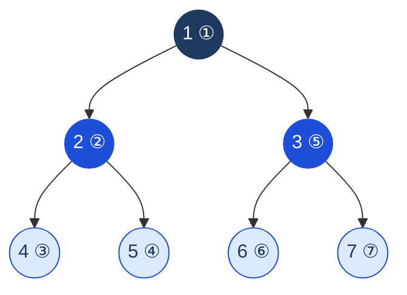

> [!pattern] Graph Traversal · Recursion · Stack

# DFS (Depth-First Search)

## What it is
Explore a graph or tree by going **as deep as possible** before backtracking. Uses recursion (implicit call stack) or an explicit stack.

> [!complexity] Complexity
> - Time: O(V + E) for graphs, O(n) for trees
> - Space: O(V) for visited set + O(h) call stack where h = height/depth

## Diagram — DFS traversal path (preorder)



*Visit order: 1 → 2 → 4 → 5 → 3 → 6 → 7. Goes deep before backtracking.*

## Template — recursive DFS on graph
```typescript
function dfs(graph: Map<number, number[]>, node: number, visited: Set<number>): void {
  visited.add(node);
  // Process node here

  for (const neighbor of graph.get(node) ?? []) {
    if (!visited.has(neighbor)) {
      dfs(graph, neighbor, visited);
    }
  }
}

// Count connected components
function countComponents(n: number, edges: number[][]): number {
  const graph = new Map<number, number[]>();
  for (let i = 0; i < n; i++) graph.set(i, []);
  for (const [u, v] of edges) {
    graph.get(u)!.push(v);
    graph.get(v)!.push(u);
  }

  const visited = new Set<number>();
  let count = 0;
  for (let i = 0; i < n; i++) {
    if (!visited.has(i)) {
      dfs(graph, i, visited);
      count++;
    }
  }
  return count;
}
```

## Template — iterative DFS (explicit stack)
```typescript
function dfsIterative(graph: Map<number, number[]>, start: number): void {
  const visited = new Set<number>();
  const stack: number[] = [start];

  while (stack.length) {
    const node = stack.pop()!;
    if (visited.has(node)) continue;
    visited.add(node);
    // Process node

    for (const neighbor of graph.get(node) ?? []) {
      if (!visited.has(neighbor)) stack.push(neighbor);
    }
  }
}
```

## Cycle detection in directed graph (coloring)
Three states: white (unvisited), grey (in current path), black (fully processed).
```typescript
function hasCycle(graph: Map<number, number[]>, n: number): boolean {
  const color = new Array(n).fill(0); // 0=white, 1=grey, 2=black

  function dfs(node: number): boolean {
    color[node] = 1; // grey — in current path
    for (const neighbor of graph.get(node) ?? []) {
      if (color[neighbor] === 1) return true;  // back edge = cycle
      if (color[neighbor] === 0 && dfs(neighbor)) return true;
    }
    color[node] = 2; // black — done
    return false;
  }

  for (let i = 0; i < n; i++) {
    if (color[i] === 0 && dfs(i)) return true;
  }
  return false;
}
```

## DFS on grid (flood fill)
```typescript
function numIslands(grid: string[][]): number {
  const rows = grid.length, cols = grid[0].length;
  let count = 0;

  function dfs(r: number, c: number): void {
    if (r < 0 || r >= rows || c < 0 || c >= cols || grid[r][c] !== '1') return;
    grid[r][c] = '0'; // mark visited
    dfs(r+1, c); dfs(r-1, c); dfs(r, c+1); dfs(r, c-1);
  }

  for (let r = 0; r < rows; r++) {
    for (let c = 0; c < cols; c++) {
      if (grid[r][c] === '1') { dfs(r, c); count++; }
    }
  }
  return count;
}
```

## Topological sort (DFS-based)
For DAGs: process nodes in reverse finish order.
```typescript
function topoSort(graph: Map<number, number[]>, n: number): number[] {
  const visited = new Set<number>();
  const order: number[] = [];

  function dfs(node: number): void {
    visited.add(node);
    for (const neighbor of graph.get(node) ?? []) {
      if (!visited.has(neighbor)) dfs(neighbor);
    }
    order.push(node); // add AFTER processing all children
  }

  for (let i = 0; i < n; i++) {
    if (!visited.has(i)) dfs(i);
  }
  return order.reverse();
}
```

## DFS vs BFS decision guide
| Problem | Use |
|---|---|
| All paths from A to B | **DFS** |
| Detect cycle | **DFS** |
| Topological sort | **DFS** |
| Connected components | Either |
| Shortest path (unweighted) | BFS |
| Level-by-level processing | BFS |

## Multi-Language Reference — DFS on Graph (recursive)

> [!example]- JavaScript
> ```javascript
> // JavaScript
> function dfs(graph, node, visited = new Set()) {
>   visited.add(node);
>   for (const neighbor of graph.get(node) ?? []) {
>     if (!visited.has(neighbor)) dfs(graph, neighbor, visited);
>   }
> }
> ```

> [!example]- Java
> ```java
> // Java
> public static void dfs(Map<Integer, List<Integer>> graph, int node, Set<Integer> visited) {
>     visited.add(node);
>     for (int neighbor : graph.getOrDefault(node, Collections.emptyList())) {
>         if (!visited.contains(neighbor)) dfs(graph, neighbor, visited);
>     }
> }
> ```

> [!example]- Python
> ```python
> # Python
> def dfs(graph, node, visited=None):
>     if visited is None: visited = set()
>     visited.add(node)
>     for neighbor in graph.get(node, []):
>         if neighbor not in visited:
>             dfs(graph, neighbor, visited)
>     return visited
> ```

> [!example]- C
> ```c
> // C (recursive DFS on adjacency matrix)
> int visited[MAX];
> void dfs(int adj[][MAX], int n, int node) {
>     visited[node] = 1;
>     for (int i = 0; i < n; i++) {
>         if (adj[node][i] && !visited[i]) dfs(adj, n, i);
>     }
> }
> ```

> [!example]- C++
> ```cpp
> // C++
> void dfs(unordered_map<int, vector<int>>& graph, int node, unordered_set<int>& visited) {
>     visited.insert(node);
>     for (int neighbor : graph[node]) {
>         if (!visited.count(neighbor)) dfs(graph, neighbor, visited);
>     }
> }
> ```

## Practice & Resources

**LeetCode — Essential Problems**
- [200 · Number of Islands](https://leetcode.com/problems/number-of-islands/) — Medium · DFS flood fill on grid
- [79 · Word Search](https://leetcode.com/problems/word-search/) — Medium · DFS + backtracking on grid
- [133 · Clone Graph](https://leetcode.com/problems/clone-graph/) — Medium · DFS with hash map
- [207 · Course Schedule](https://leetcode.com/problems/course-schedule/) — Medium · cycle detection
- [417 · Pacific Atlantic Water Flow](https://leetcode.com/problems/pacific-atlantic-water-flow/) — Medium · two-pass DFS

**References**
- [VisuAlgo · BFS/DFS](https://visualgo.net/en/dfsbfs) — animated traversal step-by-step
- [NeetCode · Graphs playlist](https://neetcode.io/roadmap)

## Related
- [[BFS (Breadth-First Search)]] — level-order alternative
- [[Stack]] — iterative DFS uses explicit stack
- [[Graph]] — primary use case
- [[Backtracking]] — backtracking is DFS with pruning
- [[Tree Traversals]] — all tree traversals (except level-order) are DFS
