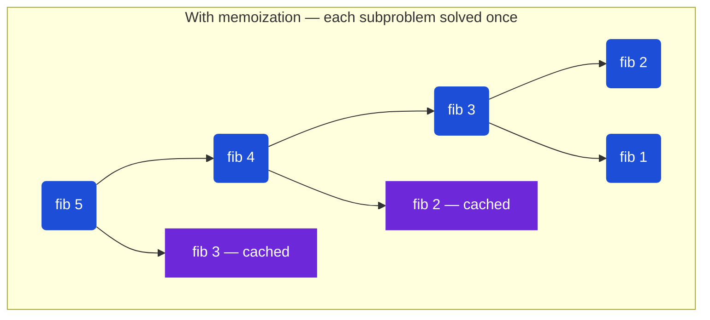

> [!pattern] Optimization · Memoization · Tabulation

# Dynamic Programming

## What It Is

Dynamic programming (DP) is a technique for solving problems with **overlapping subproblems** — where the same sub-computation would be done many times in a naive recursive solution. DP solves each subproblem once, caches the result, and reuses it.

The difference from plain recursion: plain recursion may recompute the same subproblem exponentially many times. DP + memoization reduces this to O(unique subproblems).

```
Fibonacci without DP (exponential):
fib(5)
├── fib(4)
│   ├── fib(3)          ← computed twice
│   │   ├── fib(2)      ← computed three times
│   │   └── fib(1)
│   └── fib(2)          ← again
└── fib(3)              ← again
    └── ...

With memoization: each fib(n) computed exactly once.
```

---

## Diagram — Fibonacci call tree (without vs with DP)



*Cached nodes (blue) are looked up in O(1) instead of recomputed — turning O(2ⁿ) into O(n).*

## Two Approaches

### Top-Down: Memoization (Recursion + Cache)

Write the natural recursive solution, then add a cache to avoid recomputation.

```typescript
const memo = new Map<number, number>();

function solve(n: number): number {
  if (memo.has(n)) return memo.get(n)!; // cache hit
  // ... compute result from smaller subproblems
  memo.set(n, result);
  return result;
}
```

**Pros**: natural to write (follows the recurrence directly), only computes needed subproblems
**Cons**: recursion call stack overhead, potential stack overflow for large n

### Bottom-Up: Tabulation (Iterative)

Build a table starting from the smallest subproblems, filling up to the target.

```typescript
const dp = new Array(n + 1).fill(0);
dp[0] = base_case;
for (let i = 1; i <= n; i++) {
  dp[i] = /* combine dp[i-1], dp[i-2], etc. */;
}
return dp[n];
```

**Pros**: no recursion overhead, easier to optimize space, faster in practice
**Cons**: need to figure out the iteration order, may compute unused states

---

## How to Recognize DP Problems

Ask these questions:
1. Does the problem ask for an **optimal value** (max/min) or a **count of ways**?
2. Does making a choice at one step affect future choices?
3. Would a brute-force recursive solution recompute the same subproblems?

**Keywords**: "minimum cost", "maximum profit", "how many ways", "longest subsequence", "fewest steps", "can you reach"

**Not DP**: if subproblems are independent ([[Divide & Conquer|divide & conquer]]), or if [[Greedy|greedy]] always works.

---

## The Thought Process

1. **Define the state**: what does `dp[i]` (or `dp[i][j]`) represent?
2. **Write the recurrence**: how do you compute `dp[i]` from smaller states?
3. **Identify base cases**: what are the trivially known values?
4. **Choose top-down or bottom-up**: memoization is easier to derive; tabulation is faster and easier to space-optimize
5. **Consider space optimization**: can you reduce 2D DP to 1D by only keeping the last row?

---

## TypeScript Examples

### Fibonacci

The "hello world" of DP — purely illustrative of the two approaches.

**Memoized (top-down):**
```typescript
function fibMemo(n: number, memo = new Map<number, number>()): number {
  if (n <= 1) return n;
  if (memo.has(n)) return memo.get(n)!;

  const result = fibMemo(n - 1, memo) + fibMemo(n - 2, memo);
  memo.set(n, result);
  return result;
}
```

**Tabulated (bottom-up):**
```typescript
function fibTab(n: number): number {
  if (n <= 1) return n;

  const dp = new Array(n + 1).fill(0);
  dp[1] = 1;

  for (let i = 2; i <= n; i++) {
    dp[i] = dp[i - 1] + dp[i - 2];
  }

  return dp[n];
}

// Space-optimized: only need last two values
function fibOptimal(n: number): number {
  if (n <= 1) return n;
  let prev2 = 0, prev1 = 1;
  for (let i = 2; i <= n; i++) {
    const curr = prev1 + prev2;
    prev2 = prev1;
    prev1 = curr;
  }
  return prev1;
}
```

---

### Climbing Stairs

You can climb 1 or 2 steps at a time. How many distinct ways to reach step n?

State: `dp[i]` = number of ways to reach step i
Recurrence: `dp[i] = dp[i-1] + dp[i-2]` (last step was 1 or 2 steps)

**Memoized:**
```typescript
function climbStairsMemo(n: number, memo = new Map<number, number>()): number {
  if (n <= 2) return n;
  if (memo.has(n)) return memo.get(n)!;

  const result = climbStairsMemo(n - 1, memo) + climbStairsMemo(n - 2, memo);
  memo.set(n, result);
  return result;
}
```

**Tabulated (space-optimized):**
```typescript
function climbStairsTab(n: number): number {
  if (n <= 2) return n;

  let prev2 = 1, prev1 = 2;
  for (let i = 3; i <= n; i++) {
    const curr = prev1 + prev2;
    prev2 = prev1;
    prev1 = curr;
  }
  return prev1;
}

// climbStairs(5) => 8
```

Same recurrence as Fibonacci — notice the pattern.

---

### 0/1 Knapsack

Given items with weights and values, and a capacity W, maximize total value without exceeding W. Each item can be used at most once.

State: `dp[i][w]` = max value using first i items with capacity w
Recurrence:
- Don't take item i: `dp[i][w] = dp[i-1][w]`
- Take item i (if `weights[i] <= w`): `dp[i][w] = dp[i-1][w - weights[i]] + values[i]`
- `dp[i][w] = max(don't take, take)`

**Memoized:**
```typescript
function knapsackMemo(
  weights: number[], values: number[], W: number
): number {
  const n = weights.length;
  const memo = new Map<string, number>();

  function dp(i: number, w: number): number {
    if (i === 0 || w === 0) return 0;
    const key = `${i},${w}`;
    if (memo.has(key)) return memo.get(key)!;

    let result = dp(i - 1, w); // don't take item i
    if (weights[i - 1] <= w) {
      result = Math.max(result, dp(i - 1, w - weights[i - 1]) + values[i - 1]);
    }

    memo.set(key, result);
    return result;
  }

  return dp(n, W);
}
```

**Tabulated:**
```typescript
function knapsackTab(weights: number[], values: number[], W: number): number {
  const n = weights.length;
  // dp[i][w] = max value with first i items and capacity w
  const dp: number[][] = Array.from({ length: n + 1 }, () => new Array(W + 1).fill(0));

  for (let i = 1; i <= n; i++) {
    for (let w = 0; w <= W; w++) {
      dp[i][w] = dp[i - 1][w]; // don't take
      if (weights[i - 1] <= w) {
        dp[i][w] = Math.max(dp[i][w], dp[i - 1][w - weights[i - 1]] + values[i - 1]);
      }
    }
  }

  return dp[n][W];
}

// Space-optimized: use 1D array, iterate w backwards
function knapsackOptimal(weights: number[], values: number[], W: number): number {
  const dp = new Array(W + 1).fill(0);

  for (let i = 0; i < weights.length; i++) {
    // iterate backwards to avoid using same item twice
    for (let w = W; w >= weights[i]; w--) {
      dp[w] = Math.max(dp[w], dp[w - weights[i]] + values[i]);
    }
  }

  return dp[W];
}
```

**Why iterate backwards in 1D**: processing `w` from high to low ensures that when we compute `dp[w]`, `dp[w - weights[i]]` still reflects the state before item `i` was considered (i.e., uses the previous row's value).

---

### Longest Common Subsequence (LCS)

Find the length of the longest subsequence present in both strings (characters don't need to be contiguous).

State: `dp[i][j]` = LCS length of `s1[0..i-1]` and `s2[0..j-1]`
Recurrence:
- If `s1[i-1] === s2[j-1]`: `dp[i][j] = dp[i-1][j-1] + 1`
- Else: `dp[i][j] = max(dp[i-1][j], dp[i][j-1])`

**Memoized:**
```typescript
function lcsMemo(s1: string, s2: string): number {
  const memo = new Map<string, number>();

  function dp(i: number, j: number): number {
    if (i === 0 || j === 0) return 0;
    const key = `${i},${j}`;
    if (memo.has(key)) return memo.get(key)!;

    let result: number;
    if (s1[i - 1] === s2[j - 1]) {
      result = dp(i - 1, j - 1) + 1;
    } else {
      result = Math.max(dp(i - 1, j), dp(i, j - 1));
    }

    memo.set(key, result);
    return result;
  }

  return dp(s1.length, s2.length);
}
```

**Tabulated:**
```typescript
function lcsTab(s1: string, s2: string): number {
  const m = s1.length, n = s2.length;
  const dp: number[][] = Array.from({ length: m + 1 }, () => new Array(n + 1).fill(0));

  for (let i = 1; i <= m; i++) {
    for (let j = 1; j <= n; j++) {
      if (s1[i - 1] === s2[j - 1]) {
        dp[i][j] = dp[i - 1][j - 1] + 1;
      } else {
        dp[i][j] = Math.max(dp[i - 1][j], dp[i][j - 1]);
      }
    }
  }

  return dp[m][n];
}

// lcs("abcde", "ace") => 3 ("ace")
// lcs("abc", "abc") => 3
// lcs("abc", "def") => 0
```

---

### Coin Change (Minimum Coins)

Given coin denominations, find the fewest coins needed to make `amount`. Coins can be reused.

State: `dp[i]` = minimum coins to make amount i
Recurrence: `dp[i] = min(dp[i - coin] + 1)` for each coin ≤ i
Base case: `dp[0] = 0`, everything else = Infinity

**Memoized:**
```typescript
function coinChangeMemo(coins: number[], amount: number): number {
  const memo = new Map<number, number>();

  function dp(remaining: number): number {
    if (remaining === 0) return 0;
    if (remaining < 0) return Infinity;
    if (memo.has(remaining)) return memo.get(remaining)!;

    let min = Infinity;
    for (const coin of coins) {
      const sub = dp(remaining - coin);
      if (sub !== Infinity) {
        min = Math.min(min, sub + 1);
      }
    }

    memo.set(remaining, min);
    return min;
  }

  const result = dp(amount);
  return result === Infinity ? -1 : result;
}
```

**Tabulated:**
```typescript
function coinChangeTab(coins: number[], amount: number): number {
  const dp = new Array(amount + 1).fill(Infinity);
  dp[0] = 0;

  for (let i = 1; i <= amount; i++) {
    for (const coin of coins) {
      if (coin <= i && dp[i - coin] !== Infinity) {
        dp[i] = Math.min(dp[i], dp[i - coin] + 1);
      }
    }
  }

  return dp[amount] === Infinity ? -1 : dp[amount];
}

// coinChange([1,5,11], 15) => 3 (5+5+5... actually [11+1+1+1+1] = 5? No, [5+5+5] = 3)
// coinChange([2], 3) => -1
// coinChange([1,2,5], 11) => 3 (5+5+1)
```

---

## Space Optimization

Many 2D DP tables can be reduced to 1D because each row only depends on the previous row.

```typescript
// LCS: from O(m*n) to O(n) space
function lcsOptimal(s1: string, s2: string): number {
  const n = s2.length;
  let prev = new Array(n + 1).fill(0);

  for (let i = 1; i <= s1.length; i++) {
    const curr = new Array(n + 1).fill(0);
    for (let j = 1; j <= n; j++) {
      if (s1[i - 1] === s2[j - 1]) {
        curr[j] = prev[j - 1] + 1;
      } else {
        curr[j] = Math.max(prev[j], curr[j - 1]);
      }
    }
    prev = curr;
  }

  return prev[n];
}
```

---

## Common DP Patterns

| Pattern | Description | Examples |
|---|---|---|
| Linear | dp[i] depends on dp[i-1] or dp[i-2] | Fibonacci, climbing stairs, house robber |
| Grid | dp[i][j] depends on neighbors | Unique paths, minimum path sum |
| Subsequence | dp[i][j] for two sequences | LCS, edit distance |
| Knapsack | include/exclude items | 0/1 knapsack, coin change, subset sum |
| Interval | dp[i][j] for subarray [i..j] | Matrix chain multiplication, burst balloons |

---

## Multi-Language Reference — Coin Change (Bottom-Up DP)

> [!example]- JavaScript
> ```javascript
> // JavaScript
> function coinChange(coins, amount) {
>   const dp = new Array(amount + 1).fill(Infinity);
>   dp[0] = 0;
>   for (let i = 1; i <= amount; i++)
>     for (const coin of coins)
>       if (coin <= i && dp[i - coin] !== Infinity)
>         dp[i] = Math.min(dp[i], dp[i - coin] + 1);
>   return dp[amount] === Infinity ? -1 : dp[amount];
> }
> ```

> [!example]- Java
> ```java
> // Java
> public static int coinChange(int[] coins, int amount) {
>     int[] dp = new int[amount + 1];
>     Arrays.fill(dp, Integer.MAX_VALUE);
>     dp[0] = 0;
>     for (int i = 1; i <= amount; i++)
>         for (int coin : coins)
>             if (coin <= i && dp[i - coin] != Integer.MAX_VALUE)
>                 dp[i] = Math.min(dp[i], dp[i - coin] + 1);
>     return dp[amount] == Integer.MAX_VALUE ? -1 : dp[amount];
> }
> ```

> [!example]- Python
> ```python
> # Python
> def coin_change(coins, amount):
>     dp = [float('inf')] * (amount + 1)
>     dp[0] = 0
>     for i in range(1, amount + 1):
>         for coin in coins:
>             if coin <= i and dp[i - coin] != float('inf'):
>                 dp[i] = min(dp[i], dp[i - coin] + 1)
>     return dp[amount] if dp[amount] != float('inf') else -1
> ```

> [!example]- C
> ```c
> // C
> int coinChange(int coins[], int coinsSize, int amount) {
>     int dp[amount + 1];
>     for (int i = 0; i <= amount; i++) dp[i] = amount + 1;
>     dp[0] = 0;
>     for (int i = 1; i <= amount; i++)
>         for (int j = 0; j < coinsSize; j++)
>             if (coins[j] <= i) dp[i] = dp[i] < dp[i - coins[j]] + 1 ? dp[i] : dp[i - coins[j]] + 1;
>     return dp[amount] > amount ? -1 : dp[amount];
> }
> ```

> [!example]- C++
> ```cpp
> // C++
> int coinChange(vector<int>& coins, int amount) {
>     vector<int> dp(amount + 1, INT_MAX);
>     dp[0] = 0;
>     for (int i = 1; i <= amount; i++)
>         for (int coin : coins)
>             if (coin <= i && dp[i - coin] != INT_MAX)
>                 dp[i] = min(dp[i], dp[i - coin] + 1);
>     return dp[amount] == INT_MAX ? -1 : dp[amount];
> }
> ```

## Practice & Resources

**LeetCode — Essential Problems (by pattern)**
- [70 · Climbing Stairs](https://leetcode.com/problems/climbing-stairs/) — Easy · 1D linear DP warm-up
- [198 · House Robber](https://leetcode.com/problems/house-robber/) — Medium · 1D with skip-one decision
- [322 · Coin Change](https://leetcode.com/problems/coin-change/) — Medium · unbounded knapsack
- [300 · Longest Increasing Subsequence](https://leetcode.com/problems/longest-increasing-subsequence/) — Medium · classic 1D
- [62 · Unique Paths](https://leetcode.com/problems/unique-paths/) — Medium · 2D grid DP
- [1143 · Longest Common Subsequence](https://leetcode.com/problems/longest-common-subsequence/) — Medium · 2D string DP
- [416 · Partition Equal Subset Sum](https://leetcode.com/problems/partition-equal-subset-sum/) — Medium · 0/1 knapsack

**References**
- [NeetCode · 1D and 2D DP playlists](https://neetcode.io/roadmap) — best visual explanations
- [DP Patterns reference (LC discuss)](https://leetcode.com/discuss/general-discussion/458695/dynamic-programming-patterns)

## Related

- [[Divide & Conquer]]
