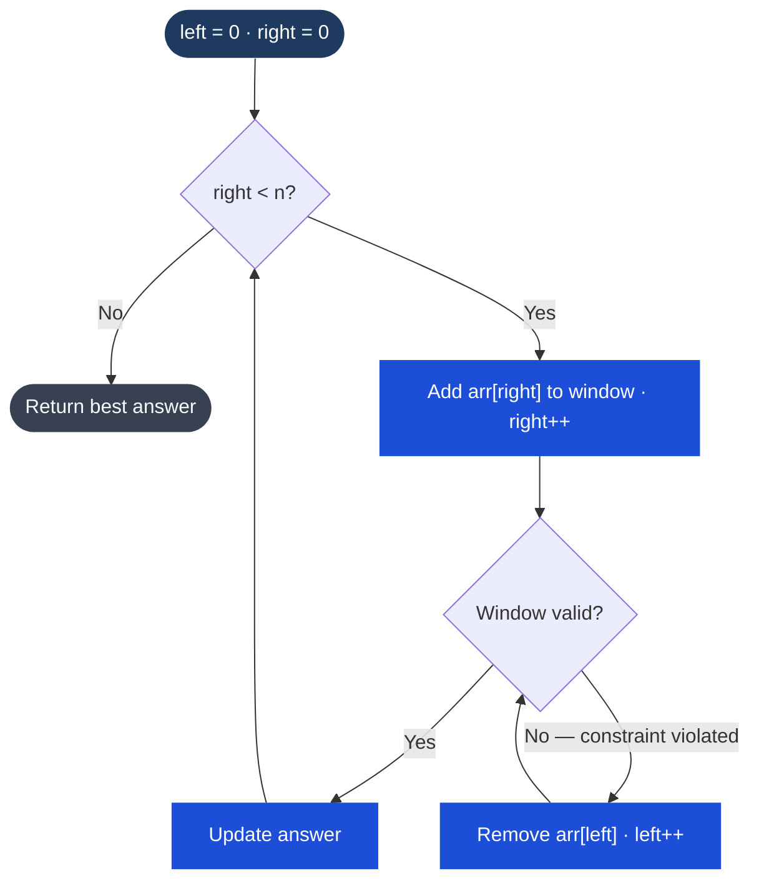

# Sliding Window

## What It Is

Sliding window is a technique for efficiently computing answers over subarrays or substrings. Instead of recomputing from scratch for every possible window (O(n²) or O(n³)), you maintain a window that slides through the data — expanding the right edge to include new elements and shrinking the left edge when a constraint is violated.

The core loop structure is always:
1. **Expand**: advance `right`, add `nums[right]` to the window state
2. **Shrink**: while the window is invalid, advance `left` and remove `nums[left]` from window state
3. **Record**: update the answer (before or after shrinking, depending on the variant)

This gives O(n) time because each element enters and exits the window at most once.

## Process Flow — Variable Sliding Window



*Each element is added once (right++) and removed at most once (left++) → O(n) total even though there are nested loops.*

---

## Two Variants

### Fixed Size Window

Window size is exactly `k`. Slide it one position at a time: add the new right element, remove the old left element.

```
k = 3
[1, 3, -1, -3, 5, 3, 6, 7]
[1, 3, -1]           → compute
   [3, -1, -3]       → slide
      [-1, -3, 5]    → slide
```

### Variable Size Window

Window grows until a constraint is violated, then shrinks until valid again. The window size is whatever satisfies the condition. Used for "longest/shortest subarray such that…" problems.

```
find longest substring with no repeats:
"abcabcbb"
 ^         left=0
 ^^^       right=2, no repeats
 ^^^^ → 'a' repeated: shrink left until window is valid
```

---

## When to Use

- "Maximum/minimum sum subarray of size k" → fixed window
- "Longest substring/subarray satisfying some condition" → variable window
- "Minimum length subarray/substring satisfying some condition" → variable window
- Any subarray/substring problem where you can efficiently update a running state as the window moves

**Dead giveaway**: "contiguous subarray", "substring", "window of size k", "longest/shortest satisfying"

---

## TypeScript Examples

### Max Sum Subarray of Size k (Fixed Window)

```typescript
function maxSumSubarray(nums: number[], k: number): number {
  let windowSum = 0;
  let maxSum = 0;

  // build initial window
  for (let i = 0; i < k; i++) {
    windowSum += nums[i];
  }
  maxSum = windowSum;

  // slide the window
  for (let right = k; right < nums.length; right++) {
    windowSum += nums[right];          // add new right element
    windowSum -= nums[right - k];      // remove element that fell out of window
    maxSum = Math.max(maxSum, windowSum);
  }

  return maxSum;
}

// maxSumSubarray([2, 1, 5, 1, 3, 2], 3) => 9  (subarray [5,1,3])
// maxSumSubarray([2, 3, 4, 1, 5], 2) => 7  (subarray [3,4])
```

**Key**: instead of recomputing the sum of k elements from scratch, just add the new element and subtract the one that left. O(n) total, O(1) per slide.

---

### Longest Substring Without Repeating Characters (Variable Window)

```typescript
function lengthOfLongestSubstring(s: string): number {
  const seen = new Map<string, number>(); // char → last seen index
  let left = 0;
  let maxLen = 0;

  for (let right = 0; right < s.length; right++) {
    const char = s[right];

    // if char is already in window, move left past its last occurrence
    if (seen.has(char) && seen.get(char)! >= left) {
      left = seen.get(char)! + 1;
    }

    seen.set(char, right);
    maxLen = Math.max(maxLen, right - left + 1);
  }

  return maxLen;
}

// lengthOfLongestSubstring("abcabcbb") => 3 ("abc")
// lengthOfLongestSubstring("bbbbb") => 1 ("b")
// lengthOfLongestSubstring("pwwkew") => 3 ("wke")
```

**Key insight**: when a duplicate is found, don't just move `left` by one — jump it past the previous occurrence of the duplicate character. Using a map of last-seen indices makes this O(1).

---

### Minimum Window Substring (Variable Window + Frequency Map)

Find the shortest substring of `s` that contains all characters of `t`.

```typescript
function minWindow(s: string, t: string): string {
  if (t.length > s.length) return "";

  // build frequency map for t
  const need = new Map<string, number>();
  for (const c of t) {
    need.set(c, (need.get(c) ?? 0) + 1);
  }

  const window = new Map<string, number>();
  let have = 0;          // how many chars satisfy their required count
  const required = need.size; // how many distinct chars we need

  let left = 0;
  let minLen = Infinity;
  let result = "";

  for (let right = 0; right < s.length; right++) {
    // expand: add s[right] to window
    const c = s[right];
    window.set(c, (window.get(c) ?? 0) + 1);

    // check if this char now satisfies its requirement
    if (need.has(c) && window.get(c) === need.get(c)) {
      have++;
    }

    // shrink: while window contains all required chars, try to minimize
    while (have === required) {
      const windowLen = right - left + 1;
      if (windowLen < minLen) {
        minLen = windowLen;
        result = s.slice(left, right + 1);
      }

      // remove left char from window
      const leftChar = s[left];
      window.set(leftChar, window.get(leftChar)! - 1);
      if (need.has(leftChar) && window.get(leftChar)! < need.get(leftChar)!) {
        have--;
      }
      left++;
    }
  }

  return result;
}

// minWindow("ADOBECODEBANC", "ABC") => "BANC"
// minWindow("a", "a") => "a"
// minWindow("a", "aa") => ""
```

**Pattern**: two frequency maps — `need` (target) and `window` (current). Track `have` vs `required` to know when the window is valid. Shrink greedily to find minimum.

---

## The Universal Variable Window Template

```typescript
function slidingWindow(nums: number[]): number {
  let left = 0;
  let windowState = 0; // could be sum, map, set, count, etc.
  let answer = 0;

  for (let right = 0; right < nums.length; right++) {
    // 1. Expand: add nums[right] to window state
    windowState += nums[right];

    // 2. Shrink: while window violates constraint, remove from left
    while (/* window is invalid */) {
      windowState -= nums[left];
      left++;
    }

    // 3. Record: window is now valid — update answer
    answer = Math.max(answer, right - left + 1);
  }

  return answer;
}
```

The only thing that changes between problems is what `windowState` is and what "invalid" means.

---

## Complexity

| Problem | Time | Space |
|---|---|---|
| Max sum subarray (fixed) | O(n) | O(1) |
| Longest no-repeat substring | O(n) | O(k) — alphabet size |
| Minimum window substring | O(n + m) | O(n + m) |

---

## Common Mistakes

- **Shrinking too aggressively**: in longest-window problems, only shrink until valid, not further
- **Updating answer at the wrong time**: for minimum problems, update inside the shrink loop; for maximum, update after shrinking
- **Map vs Set**: use a [[Hash Tables|map]] when you need counts; use a set when you just need presence
- **Fixed window off-by-one**: the element leaving the window is at index `right - k`, not `right - k + 1`

---

## Multi-Language Reference — Max Sum Subarray of Size k

```javascript
// JavaScript
function maxSumSubarray(nums, k) {
  let windowSum = nums.slice(0, k).reduce((a, b) => a + b, 0);
  let maxSum = windowSum;
  for (let i = k; i < nums.length; i++) {
    windowSum += nums[i] - nums[i - k];
    maxSum = Math.max(maxSum, windowSum);
  }
  return maxSum;
}
```

```java
// Java
public static int maxSumSubarray(int[] nums, int k) {
    int windowSum = 0;
    for (int i = 0; i < k; i++) windowSum += nums[i];
    int maxSum = windowSum;
    for (int i = k; i < nums.length; i++) {
        windowSum += nums[i] - nums[i - k];
        maxSum = Math.max(maxSum, windowSum);
    }
    return maxSum;
}
```

```python
# Python
def max_sum_subarray(nums, k):
    window_sum = sum(nums[:k])
    max_sum = window_sum
    for i in range(k, len(nums)):
        window_sum += nums[i] - nums[i - k]
        max_sum = max(max_sum, window_sum)
    return max_sum
```

```c
// C
int maxSumSubarray(int nums[], int n, int k) {
    int windowSum = 0;
    for (int i = 0; i < k; i++) windowSum += nums[i];
    int maxSum = windowSum;
    for (int i = k; i < n; i++) {
        windowSum += nums[i] - nums[i - k];
        if (windowSum > maxSum) maxSum = windowSum;
    }
    return maxSum;
}
```

```cpp
// C++
int maxSumSubarray(vector<int>& nums, int k) {
    int windowSum = 0;
    for (int i = 0; i < k; i++) windowSum += nums[i];
    int maxSum = windowSum;
    for (int i = k; i < nums.size(); i++) {
        windowSum += nums[i] - nums[i - k];
        maxSum = max(maxSum, windowSum);
    }
    return maxSum;
}
```

## Practice & Resources

**LeetCode — Essential Problems**
- [121 · Best Time to Buy and Sell Stock](https://leetcode.com/problems/best-time-to-buy-and-sell-stock/) — Easy · simplest window
- [3 · Longest Substring Without Repeating Characters](https://leetcode.com/problems/longest-substring-without-repeating-characters/) — Medium · variable window
- [424 · Longest Repeating Character Replacement](https://leetcode.com/problems/longest-repeating-character-replacement/) — Medium · window + frequency map
- [567 · Permutation in String](https://leetcode.com/problems/permutation-in-string/) — Medium · fixed window + anagram check
- [76 · Minimum Window Substring](https://leetcode.com/problems/minimum-window-substring/) — Hard · canonical hard problem
- [239 · Sliding Window Maximum](https://leetcode.com/problems/sliding-window-maximum/) — Hard · monotonic deque

**References**
- [NeetCode · Sliding Window playlist](https://neetcode.io/roadmap)
- [LeetCode Patterns](https://seanprashad.com/leetcode-patterns/)

## Related

- [[Arrays & Strings]]
- [[Two Pointers]]
- [[Hash Tables]]
