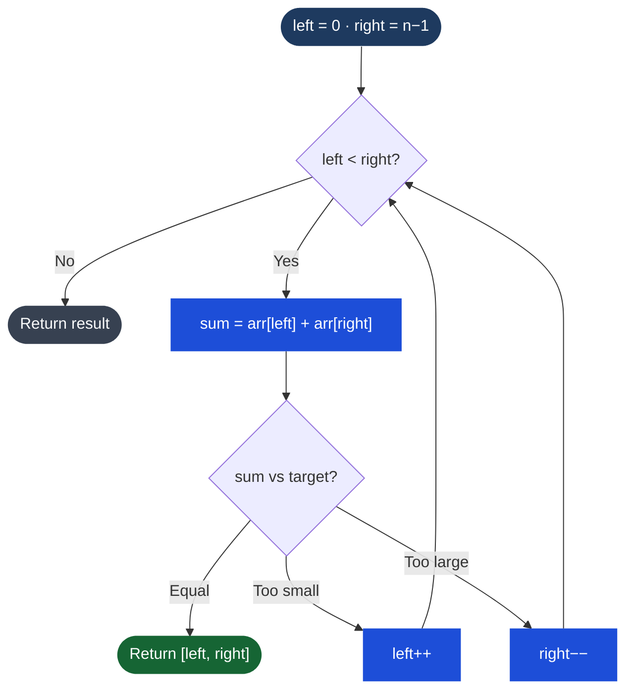

# Two Pointers

## What It Is

Two pointers is a technique where you maintain two indices into a data structure and move them strategically to avoid the nested loops that cause O(n²) time. Instead of checking every pair with a brute-force double loop, the two pointers converge on the answer in a single pass — O(n).

The key insight: if the data has structure (sorted order, palindrome symmetry, etc.), you can use that structure to decide which pointer to move, eliminating the need to check all pairs.

---

## Process Flow — Converging Pointers (Two Sum Sorted)



*Why this works on sorted arrays: if sum is too small, only moving left right can increase it. If too large, only moving right left can decrease it. No pair is skipped.*

## Two Variants

### 1. Opposite Ends (Converging Pointers)
Start `left` at index 0 and `right` at the last index. Move them toward each other based on some condition. Used when the array is sorted or when you're checking symmetry.

```
[1, 2, 3, 4, 5, 6]
 ^                ^
left             right
```

### 2. Same Direction (Fast/Slow or Read/Write)
Both pointers start at or near the beginning and move right, but at different rates or for different purposes. Used for in-place modification or when detecting a pattern in a sequence.

```
[1, 1, 2, 3, 3, 4]
 ^  ^
write read
```

---

## When to Use

- Sorted array pair sum (target = a + b)
- Palindrome check (does string read same forwards and backwards?)
- Remove duplicates from sorted array in-place
- Container with most water (maximize area between two lines)
- Any problem asking for a pair satisfying a condition in a sorted array

**Dead giveaway**: "sorted array", "find a pair", "in-place removal", "check palindrome"

---

## TypeScript Examples

### Two Sum on Sorted Array

Find two numbers that add to `target`. Return their 1-indexed positions.

```typescript
function twoSumSorted(numbers: number[], target: number): [number, number] {
  let left = 0;
  let right = numbers.length - 1;

  while (left < right) {
    const sum = numbers[left] + numbers[right];

    if (sum === target) {
      return [left + 1, right + 1]; // 1-indexed
    } else if (sum < target) {
      left++;  // need a bigger sum, move left pointer right
    } else {
      right--; // need a smaller sum, move right pointer left
    }
  }

  return [-1, -1]; // no solution
}

// twoSumSorted([2, 7, 11, 15], 9) => [1, 2]
```

**Why it works**: the array is sorted, so if the sum is too small, the only way to increase it is to advance `left`. If too large, the only way to decrease it is to retreat `right`. Each step provably eliminates a candidate.

---

### Remove Duplicates from Sorted Array In-Place

Return the count of unique elements; modify the array in-place so the first k positions hold the unique values.

```typescript
function removeDuplicates(nums: number[]): number {
  if (nums.length === 0) return 0;

  let write = 1; // next position to write a unique value

  for (let read = 1; read < nums.length; read++) {
    if (nums[read] !== nums[write - 1]) {
      nums[write] = nums[read];
      write++;
    }
  }

  return write; // count of unique elements
}

// nums = [1,1,2,3,3,4]
// after: [1,2,3,4,_,_], returns 4
```

**Pattern**: `write` pointer only advances when a new unique value is found. `read` scans everything. Classic read/write same-direction two pointers.

---

### Valid Palindrome Check

A string is a palindrome if it reads the same forward and backward, considering only alphanumeric characters.

```typescript
function isPalindrome(s: string): boolean {
  let left = 0;
  let right = s.length - 1;

  while (left < right) {
    // skip non-alphanumeric
    while (left < right && !isAlphanumeric(s[left])) left++;
    while (left < right && !isAlphanumeric(s[right])) right--;

    if (s[left].toLowerCase() !== s[right].toLowerCase()) {
      return false;
    }

    left++;
    right--;
  }

  return true;
}

function isAlphanumeric(c: string): boolean {
  return /[a-zA-Z0-9]/.test(c);
}

// isPalindrome("A man, a plan, a canal: Panama") => true
// isPalindrome("race a car") => false
```

---

### Container with Most Water

Given heights of vertical lines, find two lines that together with the x-axis form a container that holds the most water.

```typescript
function maxArea(height: number[]): number {
  let left = 0;
  let right = height.length - 1;
  let max = 0;

  while (left < right) {
    const width = right - left;
    const h = Math.min(height[left], height[right]);
    max = Math.max(max, width * h);

    // move the shorter side inward — moving the taller side can only decrease width
    // without any chance of increasing height
    if (height[left] < height[right]) {
      left++;
    } else {
      right--;
    }
  }

  return max;
}

// maxArea([1,8,6,2,5,4,8,3,7]) => 49
```

**[[Greedy]] insight**: the area is limited by the shorter line. Moving the shorter line inward is the only move that could possibly find a larger area. Moving the taller line can never help (width decreases, height is still capped by the other side).

---

## Complexity

| Problem | Time | Space |
|---|---|---|
| Two sum sorted | O(n) | O(1) |
| Remove duplicates | O(n) | O(1) |
| Valid palindrome | O(n) | O(1) |
| Container with most water | O(n) | O(1) |

All two-pointer solutions achieve O(1) space — that is often the whole point.

---

## Common Mistakes

- **Forgetting to handle edge cases**: empty array, single element, all duplicates
- **Moving both pointers simultaneously** when you should only move one per iteration
- **Off-by-one errors** on the convergence condition (`left < right` vs `left <= right`)
- **Not skipping non-relevant characters** in string problems (palindrome check)

---

## Multi-Language Reference — Two Sum Sorted

```javascript
// JavaScript
function twoSumSorted(numbers, target) {
  let left = 0, right = numbers.length - 1;
  while (left < right) {
    const sum = numbers[left] + numbers[right];
    if (sum === target) return [left + 1, right + 1];
    sum < target ? left++ : right--;
  }
  return [-1, -1];
}
```

```java
// Java
public static int[] twoSumSorted(int[] numbers, int target) {
    int left = 0, right = numbers.length - 1;
    while (left < right) {
        int sum = numbers[left] + numbers[right];
        if (sum == target) return new int[]{left + 1, right + 1};
        else if (sum < target) left++;
        else right--;
    }
    return new int[]{-1, -1};
}
```

```python
# Python
def two_sum_sorted(numbers, target):
    left, right = 0, len(numbers) - 1
    while left < right:
        s = numbers[left] + numbers[right]
        if s == target: return [left + 1, right + 1]
        elif s < target: left += 1
        else: right -= 1
    return [-1, -1]
```

```c
// C
void twoSumSorted(int numbers[], int n, int target, int result[2]) {
    int left = 0, right = n - 1;
    while (left < right) {
        int sum = numbers[left] + numbers[right];
        if (sum == target) { result[0] = left+1; result[1] = right+1; return; }
        else if (sum < target) left++;
        else right--;
    }
    result[0] = result[1] = -1;
}
```

```cpp
// C++
vector<int> twoSumSorted(vector<int>& numbers, int target) {
    int left = 0, right = numbers.size() - 1;
    while (left < right) {
        int sum = numbers[left] + numbers[right];
        if (sum == target) return {left + 1, right + 1};
        else if (sum < target) left++;
        else right--;
    }
    return {-1, -1};
}
```

## Practice & Resources

**LeetCode — Essential Problems**
- [125 · Valid Palindrome](https://leetcode.com/problems/valid-palindrome/) — Easy · warm-up
- [167 · Two Sum II](https://leetcode.com/problems/two-sum-ii-input-array-is-sorted/) — Medium · classic converging pointers
- [15 · 3Sum](https://leetcode.com/problems/3sum/) — Medium · sort + two pointers in a loop
- [11 · Container With Most Water](https://leetcode.com/problems/container-with-most-water/) — Medium · greedy pointer move
- [42 · Trapping Rain Water](https://leetcode.com/problems/trapping-rain-water/) — Hard · canonical hard problem

**References**
- [NeetCode · Two Pointers playlist](https://neetcode.io/roadmap)
- [LeetCode Patterns — Two Pointers](https://seanprashad.com/leetcode-patterns/)

## Related

- [[Arrays & Strings]]
- [[Sliding Window]]
- [[Fast & Slow Pointers]]
