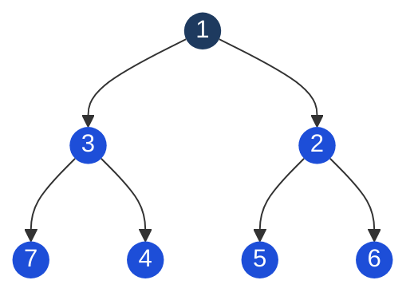

> [!pattern] Ordering · Top-K · Priority

# Heap (Priority Queue)

## What it is
A **complete binary tree** where every parent satisfies a heap property:
- **Min-heap**: parent ≤ children (root = minimum element)
- **Max-heap**: parent ≥ children (root = maximum element)

Stored as a flat **array** (no pointers needed):
- Node at index `i` → left child at `2i+1`, right child at `2i+2`, parent at `Math.floor((i-1)/2)`

> [!complexity] Complexity
> | Operation | Complexity |
> |---|---|
> | Peek min/max | O(1) |
> | Insert | O(log n) — bubble up |
> | Extract min/max | O(log n) — bubble down |
> | Build heap from array | O(n) — not O(n log n)! |
> | Search | O(n) — heaps don't support fast search |

## Diagram — Min-Heap (root = smallest)



*Every parent ≤ its children. Array form: `[1, 3, 2, 7, 4, 5, 6]` — left child of index i is at 2i+1.*

## Critical: JavaScript has no built-in heap
You must implement it or simulate with sorted array. For interviews, implement MinHeap:

```typescript
class MinHeap {
  private heap: number[] = [];

  private parent(i: number) { return Math.floor((i - 1) / 2); }
  private left(i: number) { return 2 * i + 1; }
  private right(i: number) { return 2 * i + 2; }
  private swap(i: number, j: number) {
    [this.heap[i], this.heap[j]] = [this.heap[j], this.heap[i]];
  }

  insert(val: number): void {
    this.heap.push(val);
    let i = this.heap.length - 1;
    while (i > 0 && this.heap[i] < this.heap[this.parent(i)]) {
      this.swap(i, this.parent(i));
      i = this.parent(i);
    }
  }

  extractMin(): number | undefined {
    if (!this.heap.length) return undefined;
    const min = this.heap[0];
    const last = this.heap.pop()!;
    if (this.heap.length) {
      this.heap[0] = last;
      this.bubbleDown(0);
    }
    return min;
  }

  private bubbleDown(i: number): void {
    let smallest = i;
    const l = this.left(i), r = this.right(i);
    if (l < this.heap.length && this.heap[l] < this.heap[smallest]) smallest = l;
    if (r < this.heap.length && this.heap[r] < this.heap[smallest]) smallest = r;
    if (smallest !== i) {
      this.swap(i, smallest);
      this.bubbleDown(smallest);
    }
  }

  peek(): number | undefined { return this.heap[0]; }
  size(): number { return this.heap.length; }
}
```

## Top-K pattern (most important heap use case)
**Find K largest elements in O(n log k)** — maintain a min-heap of size K:
```typescript
function topKLargest(nums: number[], k: number): number[] {
  const heap = new MinHeap();
  for (const num of nums) {
    heap.insert(num);
    if (heap.size() > k) heap.extractMin(); // evict smallest
  }
  // heap contains the K largest elements
  const result: number[] = [];
  while (heap.size()) result.push(heap.extractMin()!);
  return result;
}
// Why min-heap for K largest? The min tells you what to evict.
```

## Common interview uses
| Problem | Heap approach |
|---|---|
| Kth largest element | Min-heap of size K |
| Merge K sorted lists | Min-heap of (value, listIndex) |
| Median of data stream | Max-heap (lower half) + min-heap (upper half) |
| Task scheduling | Max-heap by frequency |
| Dijkstra shortest path | Min-heap by distance |

## Heap sort
Build max-heap in O(n), then extract max n times = O(n log n). In-place, no extra space, but not stable and poor cache performance vs [[Sorting Algorithms|merge sort]].

## Multi-Language Reference — Min-Heap / Priority Queue

> [!example]- JavaScript
> ```javascript
> // JavaScript — no built-in heap; use sorted array or implement MinHeap class (see above)
> // For interviews, declare: "I'll use a min-heap; JS needs manual implementation"
> // Minimal simulation:
> const minHeap = [];
> minHeap.push(3); minHeap.push(1); minHeap.push(2);
> minHeap.sort((a, b) => a - b); // O(n log n) — not true heap, for illustration only
> ```

> [!example]- Java
> ```java
> // Java — PriorityQueue is a min-heap by default
> PriorityQueue<Integer> minHeap = new PriorityQueue<>();
> minHeap.offer(3); minHeap.offer(1); minHeap.offer(2);
> int top = minHeap.peek();   // 1 (min)
> int removed = minHeap.poll(); // 1
> // Max-heap:
> PriorityQueue<Integer> maxHeap = new PriorityQueue<>(Collections.reverseOrder());
> ```

> [!example]- Python
> ```python
> # Python — heapq is a min-heap
> import heapq
> heap = []
> heapq.heappush(heap, 3)
> heapq.heappush(heap, 1)
> heapq.heappush(heap, 2)
> top = heap[0]            # 1 (peek min)
> removed = heapq.heappop(heap)  # 1
> # Max-heap: negate values
> heapq.heappush(heap, -5)  # store -5 to simulate max
> ```

> [!example]- C
> ```c
> // C — no built-in heap; manual array-based implementation required
> // Binary heap stored in array: parent(i)=(i-1)/2, left(i)=2i+1, right(i)=2i+2
> void swap(int* a, int* b) { int t = *a; *a = *b; *b = t; }
> void bubbleUp(int heap[], int i) {
>     while (i > 0 && heap[(i-1)/2] > heap[i]) {
>         swap(&heap[(i-1)/2], &heap[i]);
>         i = (i-1)/2;
>     }
> }
> ```

> [!example]- C++
> ```cpp
> // C++
> #include <queue>
> priority_queue<int, vector<int>, greater<int>> minHeap; // min-heap
> minHeap.push(3); minHeap.push(1); minHeap.push(2);
> int top = minHeap.top();  // 1
> minHeap.pop();
> // Max-heap (default):
> priority_queue<int> maxHeap;
> maxHeap.push(3); // top() returns largest
> ```

## Practice & Resources

**LeetCode — Essential Problems**
- [703 · Kth Largest Element in a Stream](https://leetcode.com/problems/kth-largest-element-in-a-stream/) — Easy · min-heap of size k
- [215 · Kth Largest Element in an Array](https://leetcode.com/problems/kth-largest-element-in-an-array/) — Medium · quickselect or min-heap
- [347 · Top K Frequent Elements](https://leetcode.com/problems/top-k-frequent-elements/) — Medium · heap or bucket sort
- [295 · Find Median from Data Stream](https://leetcode.com/problems/find-median-from-data-stream/) — Hard · two heaps (max + min)
- [23 · Merge K Sorted Lists](https://leetcode.com/problems/merge-k-sorted-lists/) — Hard · min-heap across k lists

**References**
- [NeetCode · Heap / Priority Queue playlist](https://neetcode.io/roadmap)
- [VisuAlgo · Heap](https://visualgo.net/en/heap) — animated insert and extract-min

## Related
- [[Binary Tree]] — heap is a complete binary tree
- [[Greedy]] — greedy algorithms often use a priority queue
- [[Sorting Algorithms]] — heap sort
- [[Graph]] — Dijkstra uses a min-heap
