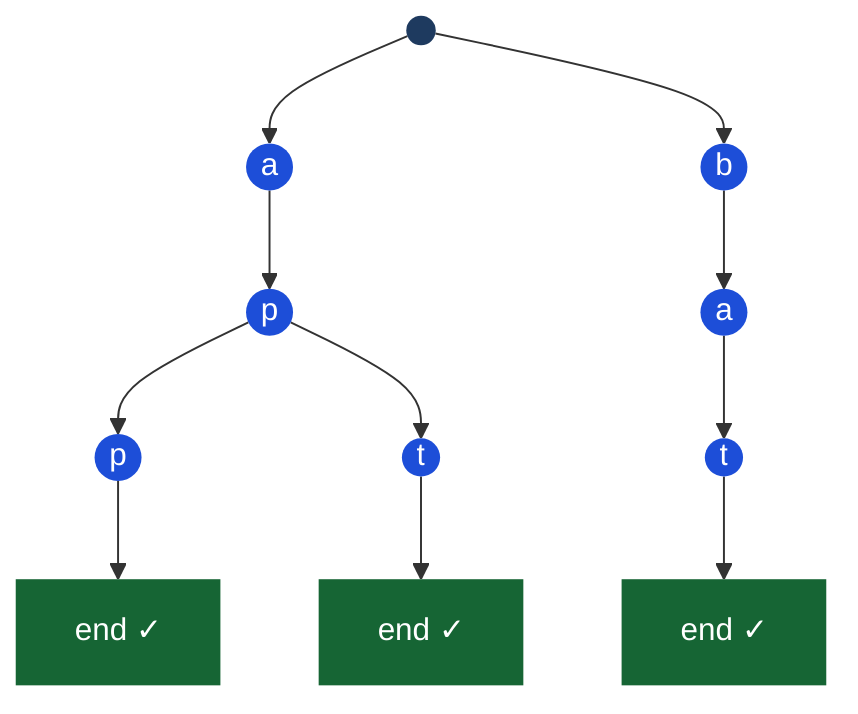

> [!pattern] String · Prefix Tree

# Trie (Prefix Tree)

## What it is
A tree where each node represents a **single character**. The path from root to any node spells out a prefix. The path to a node marked as a word-end spells out a complete word.

Think of it as an autocomplete index — every branch shares common prefixes.

> [!complexity] Complexity
> | Operation | Complexity | Notes |
> |---|---|---|
> | Insert | O(m) | m = word length |
> | Search (exact) | O(m) | |
> | startsWith (prefix) | O(m) | |
> | Space | O(n × m) worst case | n = words, m = avg length |

## Diagram — Trie storing "app", "apt", "bat"



*All words starting with "ap" share the same `a → p` path — that's the space/lookup efficiency.*

## When to use over [[Hash Tables|hash map]]
| Scenario | Trie | Hash Map |
|---|---|---|
| Exact word lookup | Both O(m) | Both fine |
| **Prefix search** | ✅ O(m) | ❌ O(n) scan |
| **Autocomplete** | ✅ natural | ❌ |
| **Word with wildcards** (`.` = any char) | ✅ DFS | ❌ |
| Frequent insert/lookup only | Hash map simpler | ✅ |

## TypeScript implementation
```typescript
class TrieNode {
  children: Map<string, TrieNode> = new Map();
  isEnd = false;
}

class Trie {
  private root = new TrieNode();

  insert(word: string): void {
    let node = this.root;
    for (const char of word) {
      if (!node.children.has(char)) {
        node.children.set(char, new TrieNode());
      }
      node = node.children.get(char)!;
    }
    node.isEnd = true;
  }

  search(word: string): boolean {
    const node = this.traverse(word);
    return node !== null && node.isEnd;
  }

  startsWith(prefix: string): boolean {
    return this.traverse(prefix) !== null;
  }

  private traverse(str: string): TrieNode | null {
    let node = this.root;
    for (const char of str) {
      if (!node.children.has(char)) return null;
      node = node.children.get(char)!;
    }
    return node;
  }
}
```

## Find all words with a given prefix
```typescript
getAllWithPrefix(prefix: string): string[] {
  const node = this.traverse(prefix);
  if (!node) return [];
  const results: string[] = [];
  this.dfs(node, prefix, results);
  return results;
}

private dfs(node: TrieNode, current: string, results: string[]): void {
  if (node.isEnd) results.push(current);
  for (const [char, child] of node.children) {
    this.dfs(child, current + char, results);
  }
}
```

## Search with wildcards (`.` matches any char)
```typescript
searchWithWildcard(word: string): boolean {
  function dfs(node: TrieNode, i: number): boolean {
    if (i === word.length) return node.isEnd;
    const char = word[i];
    if (char === '.') {
      // Try all children
      for (const child of node.children.values()) {
        if (dfs(child, i + 1)) return true;
      }
      return false;
    }
    const next = node.children.get(char);
    return next ? dfs(next, i + 1) : false;
  }
  return dfs(this.root, 0);
}
```

## Classic interview problems
- **Word Search II**: find all dictionary words in a 2D grid — Trie + [[DFS (Depth-First Search)|DFS]] + [[Backtracking|backtracking]]
- **Replace Words**: replace words with their shortest root — Trie prefix search
- **Design Search Autocomplete**: return top suggestions for a prefix

## Multi-Language Reference — Trie Insert + Search

> [!example]- JavaScript
> ```javascript
> // JavaScript
> class TrieNode { constructor() { this.children = {}; this.isEnd = false; } }
> class Trie {
>   constructor() { this.root = new TrieNode(); }
>   insert(word) {
>     let node = this.root;
>     for (const c of word) { if (!node.children[c]) node.children[c] = new TrieNode(); node = node.children[c]; }
>     node.isEnd = true;
>   }
>   search(word) {
>     let node = this.root;
>     for (const c of word) { if (!node.children[c]) return false; node = node.children[c]; }
>     return node.isEnd;
>   }
> }
> ```

> [!example]- Java
> ```java
> // Java
> class Trie {
>     private TrieNode root = new TrieNode();
>     static class TrieNode { TrieNode[] children = new TrieNode[26]; boolean isEnd; }
>     public void insert(String word) {
>         TrieNode node = root;
>         for (char c : word.toCharArray()) {
>             int i = c - 'a';
>             if (node.children[i] == null) node.children[i] = new TrieNode();
>             node = node.children[i];
>         }
>         node.isEnd = true;
>     }
>     public boolean search(String word) {
>         TrieNode node = root;
>         for (char c : word.toCharArray()) {
>             int i = c - 'a';
>             if (node.children[i] == null) return false;
>             node = node.children[i];
>         }
>         return node.isEnd;
>     }
> }
> ```

> [!example]- Python
> ```python
> # Python
> class TrieNode:
>     def __init__(self): self.children = {}; self.is_end = False
>
> class Trie:
>     def __init__(self): self.root = TrieNode()
>     def insert(self, word):
>         node = self.root
>         for c in word:
>             if c not in node.children: node.children[c] = TrieNode()
>             node = node.children[c]
>         node.is_end = True
>     def search(self, word):
>         node = self.root
>         for c in word:
>             if c not in node.children: return False
>             node = node.children[c]
>         return node.is_end
> ```

> [!example]- C
> ```c
> // C — fixed-size children array (lowercase letters only)
> #define ALPHA 26
> typedef struct TrieNode { struct TrieNode* children[ALPHA]; int isEnd; } TrieNode;
> TrieNode* newNode() { TrieNode* n = calloc(1, sizeof(TrieNode)); return n; }
> void insert(TrieNode* root, const char* word) {
>     TrieNode* node = root;
>     for (; *word; word++) {
>         int i = *word - 'a';
>         if (!node->children[i]) node->children[i] = newNode();
>         node = node->children[i];
>     }
>     node->isEnd = 1;
> }
> int search(TrieNode* root, const char* word) {
>     TrieNode* node = root;
>     for (; *word; word++) { int i = *word - 'a'; if (!node->children[i]) return 0; node = node->children[i]; }
>     return node->isEnd;
> }
> ```

> [!example]- C++
> ```cpp
> // C++
> struct TrieNode { unordered_map<char, TrieNode*> children; bool isEnd = false; };
> class Trie {
>     TrieNode* root = new TrieNode();
> public:
>     void insert(string word) {
>         TrieNode* node = root;
>         for (char c : word) { if (!node->children.count(c)) node->children[c] = new TrieNode(); node = node->children[c]; }
>         node->isEnd = true;
>     }
>     bool search(string word) {
>         TrieNode* node = root;
>         for (char c : word) { if (!node->children.count(c)) return false; node = node->children[c]; }
>         return node->isEnd;
>     }
> };
> ```

## Practice & Resources

**LeetCode — Essential Problems**
- [208 · Implement Trie (Prefix Tree)](https://leetcode.com/problems/implement-trie-prefix-tree/) — Medium · build the data structure
- [211 · Design Add and Search Words Data Structure](https://leetcode.com/problems/design-add-and-search-words-data-structure/) — Medium · trie with wildcard `.` search
- [648 · Replace Words](https://leetcode.com/problems/replace-words/) — Medium · find shortest prefix in trie
- [212 · Word Search II](https://leetcode.com/problems/word-search-ii/) — Hard · backtracking on grid + trie pruning

**References**
- [NeetCode · Tries playlist](https://neetcode.io/roadmap)
- [VisuAlgo · Trie](https://visualgo.net/en/suffixtree) — prefix tree visualization

## Related
- [[Hash Tables]] — alternative for exact lookup
- [[DFS (Depth-First Search)]] — used to traverse/search the trie
- [[Backtracking]] — word search on grid uses trie + backtracking
